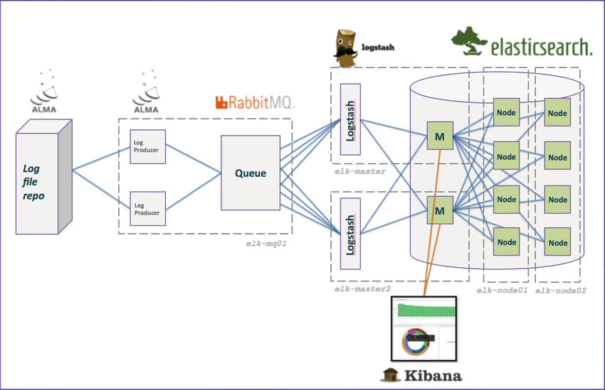
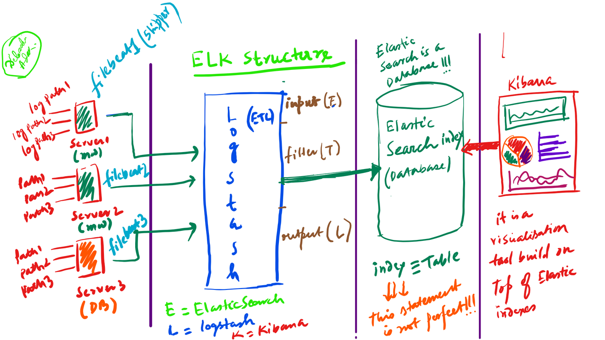
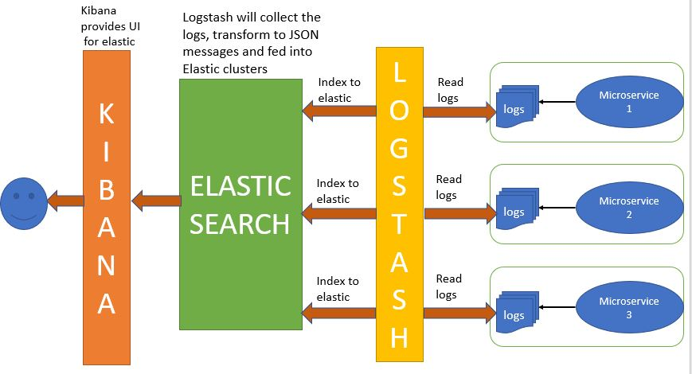
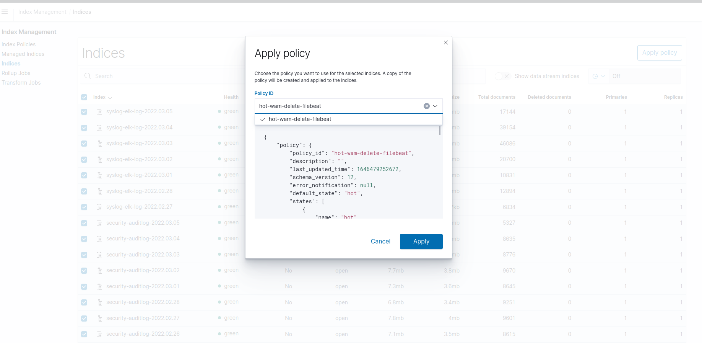
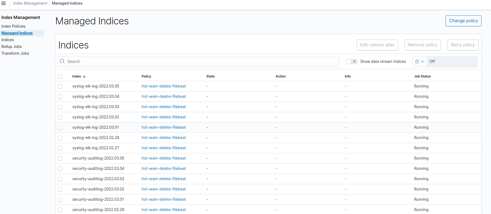
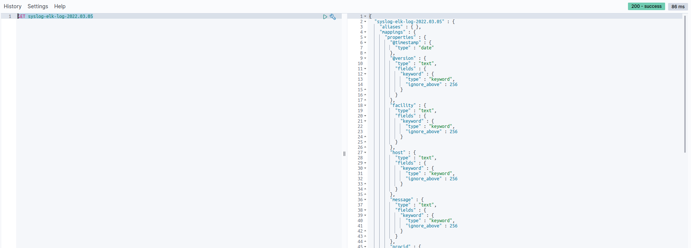

# Elk config for your project 


MetricBeat - Used for capturing system related metrics like CPU usage, Heap Usage etc
PacketBeat - For monitoring network data
WinlogBeat - For capturing windows event logs
AuditBeat - Monitor user activity and processes
HeartBeat - For uptime monitoing
FunctionBeat - Serverless architectures let you deploy code, without needing to spin up and manage extra underlying software and hardware. Functionbeat brings that same simplicity to monitoring your cloud infrastructure.

Input - It receives data sent by different beats
Filter - Here you need to write parser to parse the data
Output - It pushes data to ElasticSearch Indexes via API call








```
https://www.elastic.co/downloads/past-releases
```

OSS is importan for your project when you need a free version
```
Logstash OSS 8.0.0
```


### opendistro
```
https://opendistro.github.io/for-elasticsearch-docs/docs/install/
```

### Operating system and JVM compatibility
```
https://opensearch.org/docs/latest/opensearch/install/compatibility

```
#### Important settings on kernel
```
https://opensearch.org/docs/latest/opensearch/install/important-settings/
```

### step1 ones
```
./ssl/ssl-gen.sh
```
### step2 up docker-compose
```
 docker-compose up -d
```

### step3 up docker-compose
```
docker-compose down 
```

You can go to this directory for config files
```
cd /var/lib/docker/volumes/opensearch_opensearch-data1-config/_data/config
```

You can change jvm.options for jvm machine
```
cat jvm.options
```


### step4 make subject for security on opensearch
```
cd ssl/
openssl x509 -subject -nameopt RFC2253 -noout -in node1.pem
openssl x509 -subject -nameopt RFC2253 -noout -in node2.pem
openssl x509 -subject -nameopt RFC2253 -noout -in node3.pem

subject=CN=opensearch-node1,OU=UNIT,O=ORG,L=TEHRAN,ST=ARIA,C=CA
```
you must run this command for all of nodes on your services finally add outpu these files
```
opensearch-1.yml 
opensearch-2.yml 
opensearch-3.yml 
```
## step5 you need copy 3 files on other location
```
cp opensearch-1.yml /var/lib/docker/volumes/elk_opensearch-data1-config/_data/config/opensearch.yml 

cp opensearch-2.yml /var/lib/docker/volumes/elk_opensearch-data2-config/_data/config/opensearch.yml 

cp opensearch-3.yml /var/lib/docker/volumes/elk_opensearch-data3-config/_data/config/opensearch.yml
```

## step6 run these command on linux for copy ssl files 

```
cd ssl 
cp *.pem /var/lib/docker/volumes/elk_opensearch-data1-config/_data/config/

cp *.pem /var/lib/docker/volumes/elk_opensearch-data2-config/_data/config/

cp *.pem /var/lib/docker/volumes/elk_opensearch-data3-config/_data/config/
```

## step7 change permission on linux for elk services

```
chown -R 1000.1000 /var/lib/docker/volumes/elk_opensearch-data1-config/_data/config/
chown -R 1000.1000 /var/lib/docker/volumes/elk_opensearch-data2-config/_data/config/
chown -R 1000.1000 /var/lib/docker/volumes/elk_opensearch-data3-config/_data/config/

```

## step8 run this command for up all of Containers

```
docker-compose up -d
```

## step9 set security plugin configuration

```
docker exec -ti opensearch-node1 bash

ls

ls plugins/opensearch-security/
```

## step10 set security plugin configurations on container
```
sh plugins/opensearch-security/tools/securityadmin.sh  -backup ./backup -cd plugins/opensearch-security/securityconfig/ -icl -nhnv -cacert config/root-ca.pem -cert config/admin.pem -key config/admin-key.pem 

```

## step11 check autentication on elk on container
```
curl -XGET --insecure -u 'admin:admin' https://localhost:9200/_cluster/health?pretty
```
## open dashboard
```
http://ip:5601/app/login?nextUrl=%2F
```


```
vim /etc/rsyslog.d/60-output.conf 

# This line sends all lines to defined IP address at port 10514,
# using the "json-template" format template
*.*                         @127.0.0.1:5045;json-template

```


```
vim /etc/rsyslog.d/01-json-template.conf 

template(name="json-template"
  type="list") {
    constant(value="{")
      constant(value="\"@timestamp\":\"")     property(name="timereported" dateFormat="rfc3339")
      constant(value="\",\"@version\":\"1")
      constant(value="\",\"message\":\"")     property(name="msg" format="json")
      constant(value="\",\"sysloghost\":\"")  property(name="hostname")
      constant(value="\",\"severity\":\"")    property(name="syslogseverity-text")
      constant(value="\",\"facility\":\"")    property(name="syslogfacility-text")
      constant(value="\",\"programname\":\"") property(name="programname")
      constant(value="\",\"procid\":\"")      property(name="procid")
    constant(value="\"}\n")
}
```


### add logstash

```
vim logstash/pipeline/00-input.conf

```

you must add in logstash
```
        udp {
                type => "syslog"
                port => 5045
                codec => "json"                                                                          

        }

```

### you need to add this pip in logstash in output
```
if [type] == "syslog" {
        elasticsearch {
                hosts => ["https://opensearch-node1:9200", "https://opensearch-node2:9200", "https://opensearch-node3:9200"]
                ssl => true
                ssl_certificate_verification => false
                user => admin
                password => admin
                index => "%{type}-log-%{+YYYY.MM.dd}"
        } # end of elastic

} 

```

## you have to restart rsyslog

```
systemctl restart rsyslog.service
```

### nginx
```

log_format custom '$host - $remote_addr - $remote_user [$time_local] - '
'"$request" $status $body_bytes_sent - '
'"$http_referer" "$http_user_agent" - '
'cache: $upstream_cache_status [$time_local] - '
'content_type: $sent_http_content_type';


        access_log /var/log/nginx/access.log custom;
        error_log /var/log/nginx/error.log;
```

change port 80 to 8080


### download filebeat for nginx

```
wget  https://www.elastic.co/downloads/past-releases/filebeat-oss-7-10-2
dpkg -i https://www.elastic.co/downloads/past-releases/filebeat-oss-7-10-2
```

```
cd /etc/filebeat/


/etc/filebeat/modules.d


vim filebeat.yml

```
```
# ============================== Filebeat inputs ===============================

filebeat.inputs:
- type: log
  enabled: true
  paths:
    - /var/log/nginx/access.log*
  exclude_files: ['.gz$']
  fields:
    type: access
  fields_under_root: true

- type: log
  enabled: true
  paths:
    - /var/log/nginx/error.log*
  exclude_files: ['.gz$']
  fields:
    type: error
  fields_under_root: true

# ============================== Filebeat modules ==============================

filebeat.config.modules:
  # Glob pattern for configuration loading
  path: ${path.config}/modules.d/*.yml

  # Set to true to enable config reloading
  reload.enabled: false

  # Period on which files under path should be checked for changes
  #reload.period: 10s

# ================================== Outputs ===================================

# ------------------------------ Logstash Output -------------------------------
output.logstash:
  hosts: ["localhost:5044"]

# ================================= Processors =================================
processors:
  - add_host_metadata:
      when.not.contains.tags: forwarded
  - add_cloud_metadata: ~
  - add_docker_metadata: ~
  - add_kubernetes_metadata: ~


#  ================================ Loging ====================
logging.level: error
logging.to_files: true
logging.files:
  path: /var/log/filebeat
  name: filebeat
  keepfiles: 7  ## 7 day for keeping
  permissions: 0644
=================================================================

```
```
mkdir /var/log/filebeat

chmod 777 -R /var/log/filebeat
```
https://grokdebug.herokuapp.com/

## delete filebeat
```
docker container exec -it opensearch-node1 bash

curl --insecure -XDELETE -u 'admin:admin' https://localhost:9200/filebeat-reza-7.10.2-2022.02.28
```

## add filter for nginx
```
filter {
 
 if "access" in [type] {
    grok {  
      match => { "message" => '%{IPORHOST:host_name} - %{IPV4:remote_ip} - %{DATA:user_name} \[%{HTTPDATE:access_time}\] - "%{WORD:http_method} %{DATA:url} HTTP/%{NUMBER:http_version}" %{NUMBER:response_code} %{NUMBER:body_sent_bytes} - "%{DATA:referrer}" "%{DATA:user_agent}" - cache: %{DATA:cache_status} \[%{HTTPDATE:time_local}\] - content_type: %{DATA:content_type}$' }
      remove_field => "message"
    }
    
    }
  
  
  
  else if "network-conn" in [type] {
    
    geoip {
       database => "/usr/share/logstash/GeoLite2-City.mmdb"
       source => "id.orig_h"
       target => "src_geo"
    }
    
    
    }


}
```


## add policy on Dashboard






## add policy for hot and warm and cold\

```
{
    "policy": {
        "policy_id": "hot-wam-delete-filebeat",
        "description": "",
        "default_state": "hot",
        "states": [
            {
                "name": "hot",
                "actions": [
                    {
                        "replica_count": {
                            "number_of_replicas": 0
                        }
                    },
                    {
                        "allocation": {
                            "require": {
                                "temp": "hot"
                            },
                            "wait_for": false
                        }
                    }
                ],
                "transitions": [
                    {
                        "state_name": "warm",
                        "conditions": {
                            "min_index_age": "2d"
                        }
                    }
                ]
            },
            {
                "name": "warm",
                "actions": [
                    {
                        "allocation": {
                            "require": {
                                "temp": "warm"
                            },
                            "wait_for": false
                        }
                    },
                    {
                        "replica_count": {
                            "number_of_replicas": 1
                        }
                    }
                ],
                "transitions": [
                    {
                        "state_name": "delete",
                        "conditions": {
                            "min_index_age": "7d"
                        }
                    }
                ]
            },
            {
                "name": "delete",
                "actions": [
                    {
                        "delete": {}
                    }
                ],
                "transitions": []
            }
        ],
        "ism_template": {
            "index_patterns": [
                "filebeat*"
            ],
            "priority": 100
        }
    }
}

```
### syslog

```
{
    "policy": {
        "policy_id": "hot-wam-delete-syslog",
        "description": "",
        "default_state": "hot",
        "states": [
            {
                "name": "hot",
                "actions": [
                    {
                        "replica_count": {
                            "number_of_replicas": 0
                        }
                    },
                    {
                        "allocation": {
                            "require": {
                                "temp": "hot"
                            },
                            "wait_for": false
                        }
                    }
                ],
                "transitions": [
                    {
                        "state_name": "warm",
                        "conditions": {
                            "min_index_age": "2d"
                        }
                    }
                ]
            },
            {
                "name": "warm",
                "actions": [
                    {
                        "allocation": {
                            "require": {
                                "temp": "warm"
                            },
                            "wait_for": false
                        }
                    },
                    {
                        "replica_count": {
                            "number_of_replicas": 1
                        }
                    }
                ],
                "transitions": [
                    {
                        "state_name": "delete",
                        "conditions": {
                            "min_index_age": "7d"
                        }
                    }
                ]
            },
            {
                "name": "delete",
                "actions": [
                    {
                        "delete": {}
                    }
                ],
                "transitions": []
            }
        ],
        "ism_template": {
            "index_patterns": [
                "syslog*"
            ],
            "priority": 100
        }
    }
}


```