# Logstash

## importance of LogStash
* open source data collection engine
* Centralize data processing of all types
* Normalized varying schema for business critical data
* Support for multiple and custom formats
* Extensibility via plugins

## core Features
* Data ingestion workhorse
* Events enrichment and transformation
* extensible plugin ecosystem
* it is highly available,scalable and elastic in nature.
* Pluggable pipeline archtecture
* Horizontally scalable data processing pipline
* Stong Elasticsearch and Kibana synergy
* Handles data of all shapes and sizes


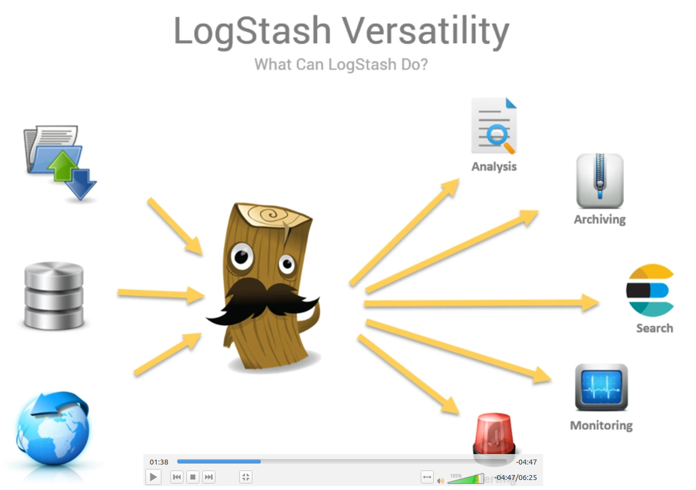


## download logstash
```
https://download.elastic.co/logstash/packages/debian/logstash_2.3.4-1_all.deb
dpkg -i logstash_2.3.4-1_all.deb
```

OR
```
https://artifacts.elastic.co/downloads/logstash/logstash-7.10.2-amd64.deb

dpkg -i logstash-7.10.2-amd64.deb
cd /usr/share/logstash/bin

./logstash -e 'input {stdin{}} output {stdout {}}'
```

## simple pipline
* verify LogStash installation with a simple pipline
* will take input from command line and output it back to the command line
* Pipline configuration information is passed as text on command line
* Takes input from standard input stdin
* Outputs to standard output stdout in a structured format

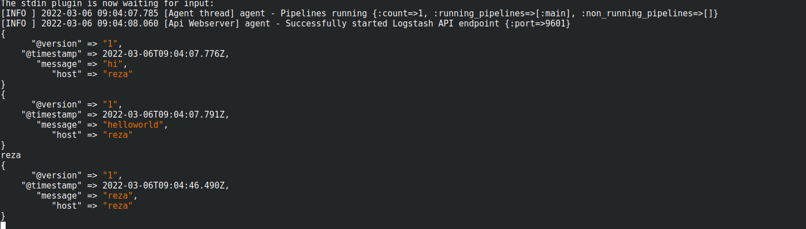

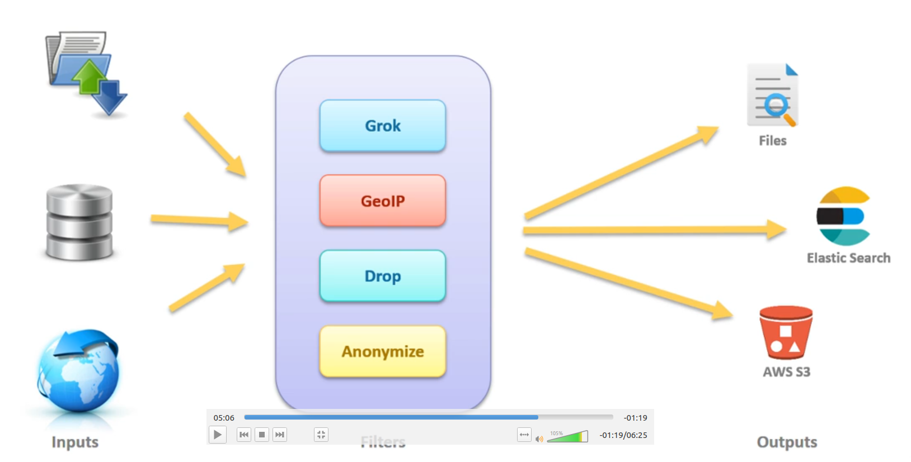

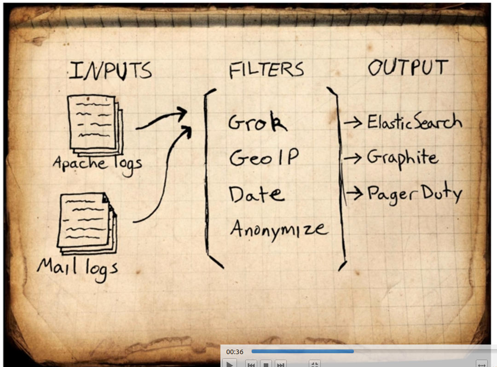

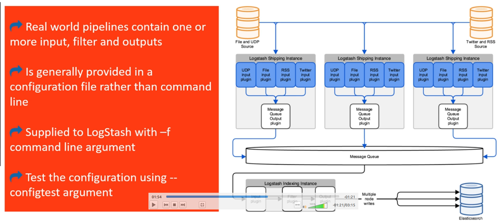

## filter on logstash

### input

how to write inpute in logstash


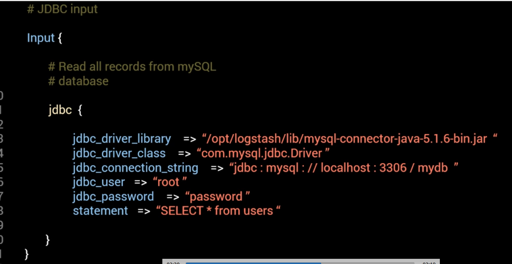

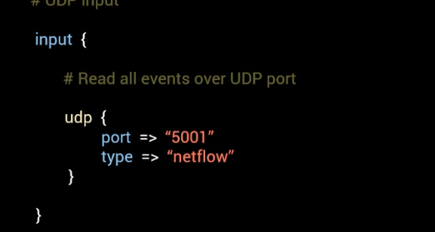

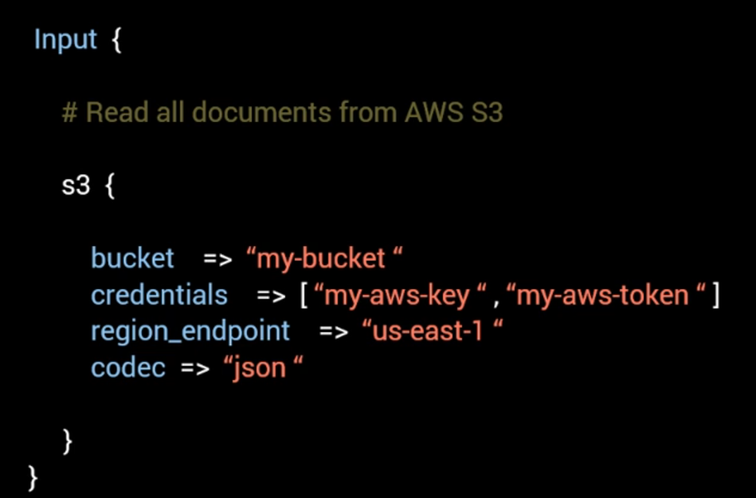


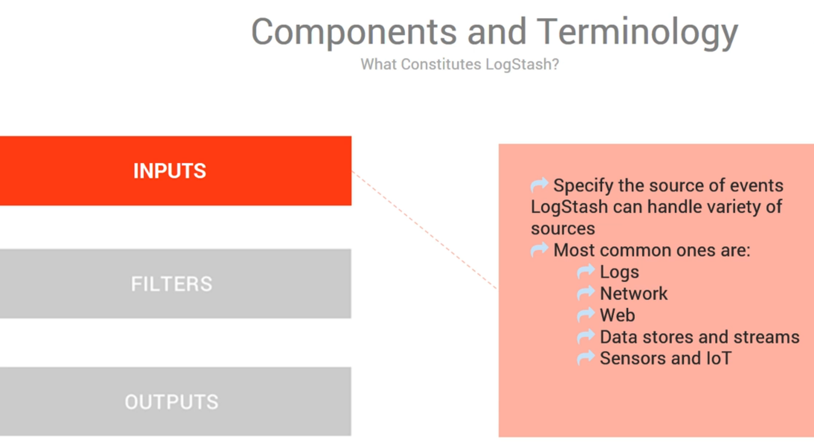

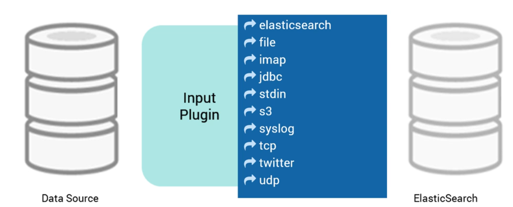

### output
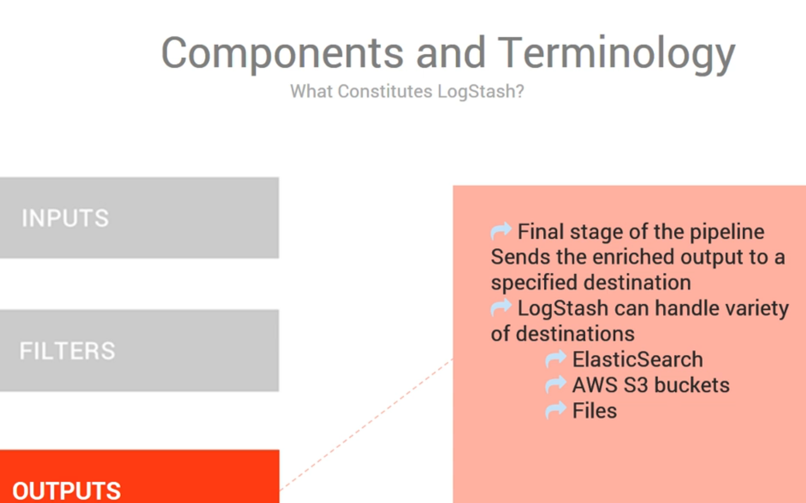


filter-grok

* Grok is one of the most widely used plugin
* It is instrumental in parsing arbitrary and unstructured text into structed and queryable data field
* It is widely used to parse syslog, apache logs, mySQL logs, custom application logs postfix logs etc
* Grok works base on patterns
* syntax for grok pattern is %{SYNTAX:SEMANTIC}
* custme patterns can be added

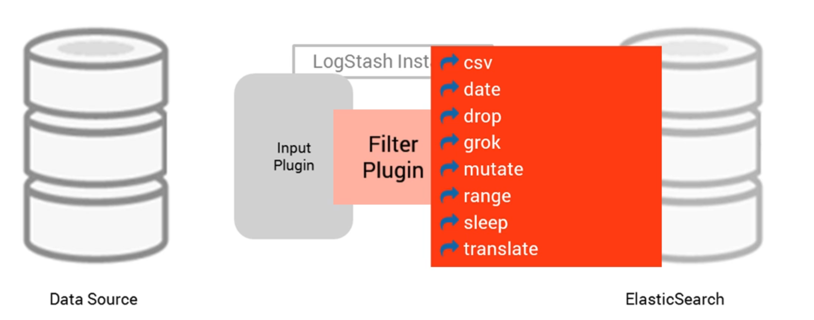

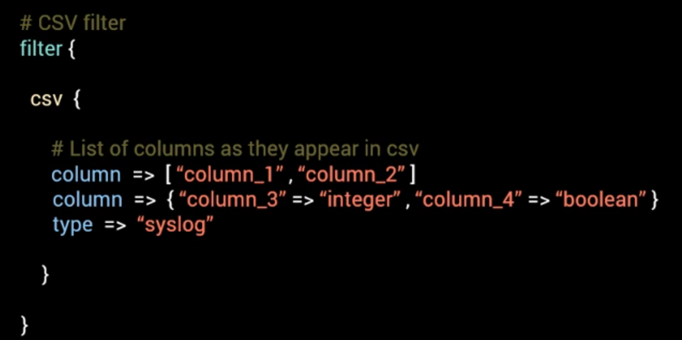


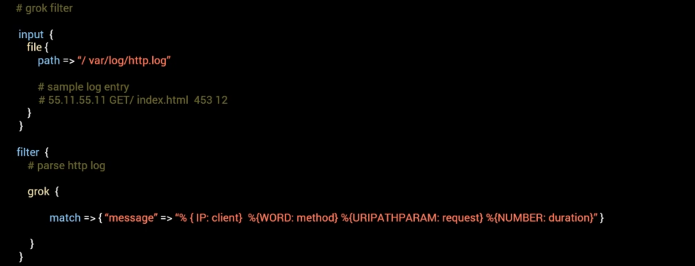


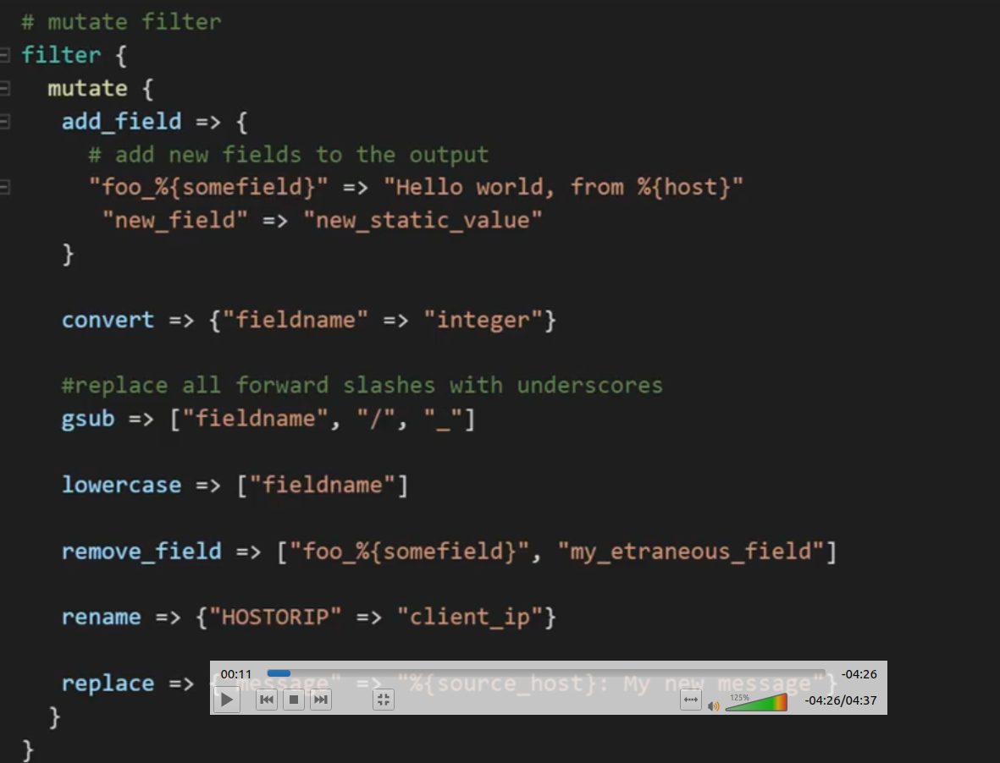

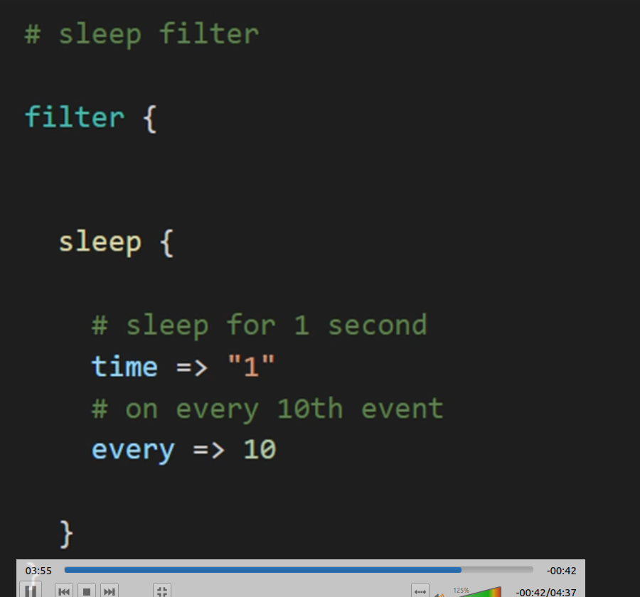

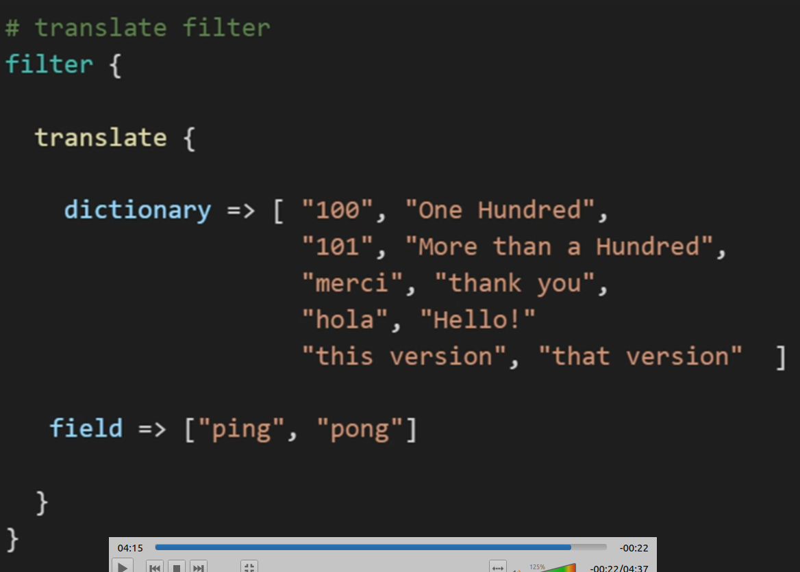


## Steps To Bulk Import Data
```
curl -s -XPOST localhost:9200/actresses/_bulk --data-bindary @sctresses.json;


https://github.com/TetraTutorials/imdb_data_import_elastic

https://datasets.imdbws.com/
http://ftp.funet.fi/pub/mirrors/ftp.imdb.com/pub/frozendata/
unzip file.zip
head -n 400 name.basics.tsv
```
