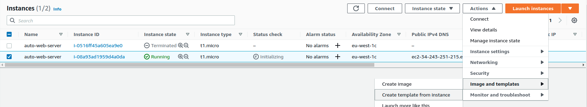
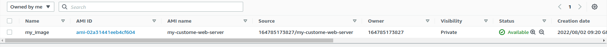
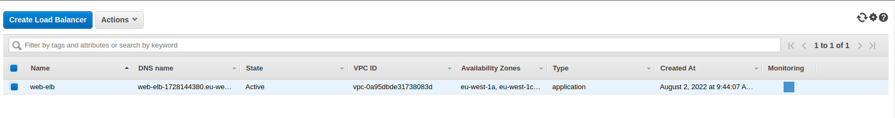
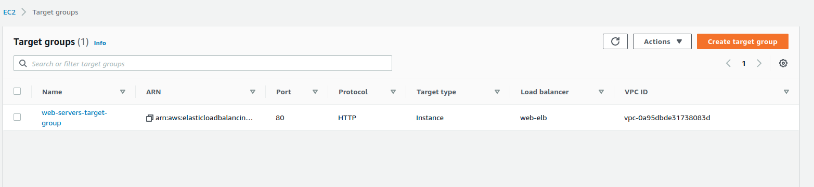
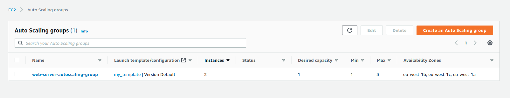
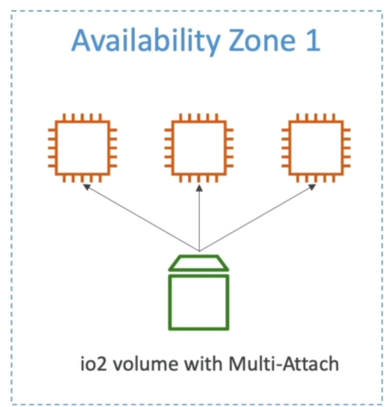
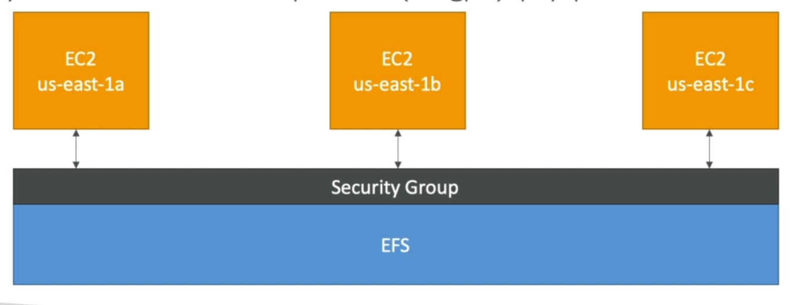

## how to install httpd on aws 

you can add this command on user data
```
#!/bin/bash
yum install -y httpd
chkconfig httpd on
echo "<h1><br>Welcome to my world<></h1>" > /var/www/html/index.html
service httpd start
```


# aws auto scaling








# terraform_on_aws


## How to start

## step one 
You can install terraform and aws to connect to AWS cloud

### installing Terraform
```
wget https://releases.hashicorp.com/terraform/1.0.7/terraform_1.0.7_linux_amd64.zip
unzip terraform_1.0.7_linux_amd64.zip
sudo mv terraform /usr/local/bin/
terraform --version

```
### installing AWS Cli
```
curl "https://awscli.amazonaws.com/awscli-exe-linux-x86_64.zip" -o "awscliv2.zip"
unzip awscliv2.zip
sudo ./aws/install

```
### How to set Access key ID and Secret access key to connect AWS

You can run this command on your client or server for connectiing AWS Cloud

```
aws configure

Note: if you run aws configure that you get this paramteres or variable to input you'r accesskey
AWS Access Key ID [None]: AKIASMXTWGVDDEDEDOHZYUD
AWS Secret Access Key [None]: ejQnXEy/l6TU73Pj7fVg         
Default region name [None]: eu-west-1


```
* How to test it awscli

```
aws iam list-users

aws iam list-users --resion

```

### IAM Guidelines & Best Practices

* Don't use the root account except for AWS account setup
* One physical user =One AWS user
* Assign Users to groups and assign permission to groups
* Create a strong password policy
* Use and enforce the use of Multi Factor Authentication (MFA)
* Create and use Roles for giving permissions to AWS services
* Use Access keys for programmatic Access (CLI /  SDK)
* Audit permission of your account with theIAM Credential Report

### IAM Section - Summary
* Users: mapped to a physical user.has a password for AWS Console
* Groups: contains users only
* Policies: Json document that outline permission for users or groups
* Roles: for EC2 instances or AWS services
* Security: MFA + Password Policy
* Access Keys: access AWS using the CLI or SDK
* Audit: IAM Credential Reports & IAM Access Advisor


### EC2

```
https://aws.amazon.com/ec2/instance-types/

https://instances.vantage.sh/
```

### EBS Snapshot
* Make a backup (snapshot) of your EBS volume at a point in time 
* Note necessary to detach volume to do snapshot, but recommended
* Can copy snapshots across AZ or Region

### How to connect to AWS Instance
```
chmod 400 ec2.pem
or
chmod 0400 ec2.pem

ssh -i ect.pem ec2-user@54.34.23.4
```
# Adding on user data when You want to deploy EC2 Instance
```
#!/bin/bash
# Use this for your user data (script from top to bottom
# install httpd (Linux 2 version) 
yum update -y
yum install -y httpd
systemctl start httpd
systemctl enable httpd
echo "<h1>Hello World from $(hostname -f)</h1> " > /var/www/html/index.html
```

### Importand command with Terraform

```
terraform init

terraform fmt

terraform validate

terraform plan

terraform plan

terraform apply

terraform destroy
```
### How to change access key and region

```
cat .aws/config
cat .aws/credentials
```
### how to work with aws cli
```
aws ec2 create-key-pair --key-name 'first-keypair-jul-2019' --query 'KeyMaterial' --output text > first-keypair-jul-2019.pem

aws ec2 describe-key-pairs

aws ec2 create-security-group --group-name MySecurityGroup --description "My security group"

aws ec2 describe-vpcs

aws ec2 create-security-group --group-name MySecurityGroup_vpc --description "My security group" --vpc-id vpc-0a95dbde31738083d

aws ec2 describe-security-groups

aws ec2 authorize-security-group-ingress --group-id sg-09d33d937439474db --protocol tcp --port 22 --cidr 0.0.0.0/32
```
### how to create instance with aws cli
```
aws ec2 describe-subnets

aws ec2 run-instances --image-id ami-0d71ea30463e0ff8d --count 1 --instance-type t2.micro --key-name first-keypair-jul-2019 --security-group-ids sg-09d33d937439474db --subnet-id subnet-0d85274255bf8c64e

aws ec2 delete-key-pair --key-name first-keypair-jul-2019

aws ec2 describe-security-groups

aws ec2 delete-security-group --group-id sg-09d33d937439474db

aws ec2 terminate-instances --instance-id i-023f437728b79c

```


## AMI Overview

AMI =Amazon Machine Image
AMI are a Customer of an EC2 instance
* You add your own sofware, configuration, operating system, monitoring configuration
* Fast boot / configuration time becasue all your software is pre- packaged
  


## How to create instance and snapshot from befor instance and then creating instance and use your snapshot for image 

```
Click right and then click on the Image and templates

```

### EC2 Instance Storage
* EBS volumes are network drives with good but limited performance
* if you need a hight-performance hardware disk, use EC2 instance Storage
* Better I/O performance 
* EC2 Instance Storage lose their storage if they're stopped (ephemeral)
* Good for buffer / cache / scratch data / temporay content
* Risk of data loss if hardware fails
* Backups and Replication are your responsiblity
  
EBS Volume Types
* EBS Volumes come in 6 types
* gp2 / gp3 (SSD): General purpose SSD Volume
* io 1 / io2 (SSD): hight performance SSD Volume for mission critical low latency
* stl (HDD): Lowest cost HDD volume designed for less frequently
* sc1 (HDD): lowest cost HDD volume designed for less frequently accessed workloads


### EBS Multi-Attach

io1/io2 family
* Attach the same EBS volume to multiple EC2 instance in the same AZ
* Each instance has full read & write permission to the volume
* Use case: 
  * Achieve higher application availability in clustered Linux applications (ex:Teradata)
  * Applications must manage concurrent write operations
* Must use a file a file system that's cluster-aware ( not XFS,EX4, ect..)



### EFS Elastic file system
* Managed NFS ( network file system) that can be mounted on many EC2
* EFS Works with EC2 instance in multi-AZ
* Highly available, scalable, expensive (3x gp2), pay per use



* Use cases: content management, web serving, data sharing, wordpress
* Uses NFS4.1. I protocol
* Uses security group to control access to EFS
* Compatible with linux base AMI( not Windows)
* Encryption at rest using KMS
* Posix file system ( linux ) that has a standard file API
* file system scales automatically, pay-per-use, no capacity planning


```
sudo yum install -y amazon-efs-utils

mkdir efs

sudo mount -t efs -o tls fs-0936c16856ab57f28:/ efs 

```


