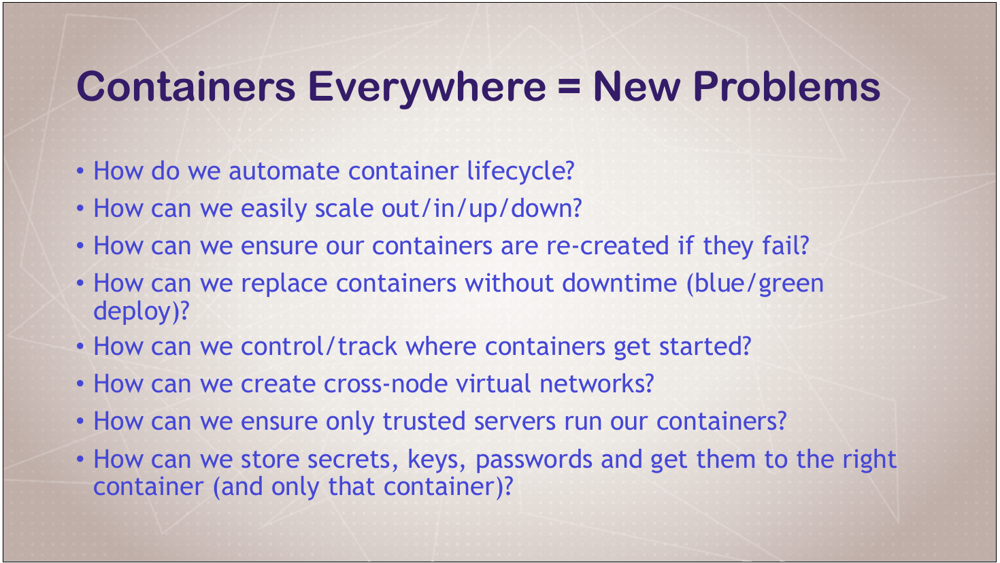
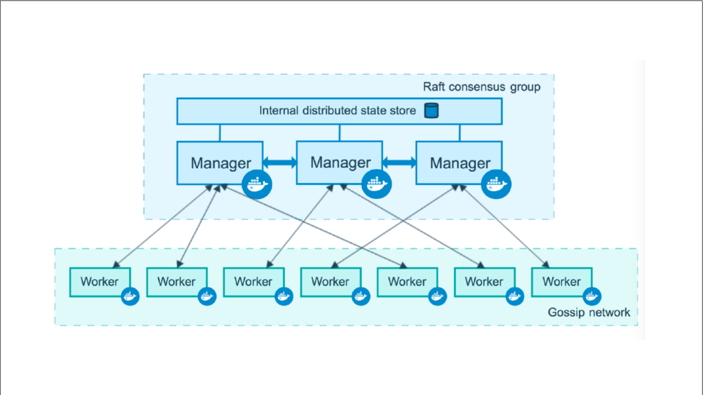
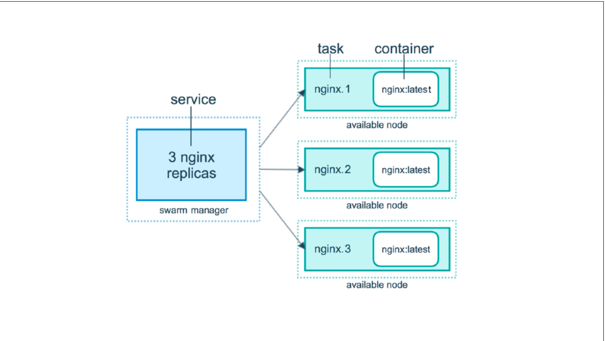
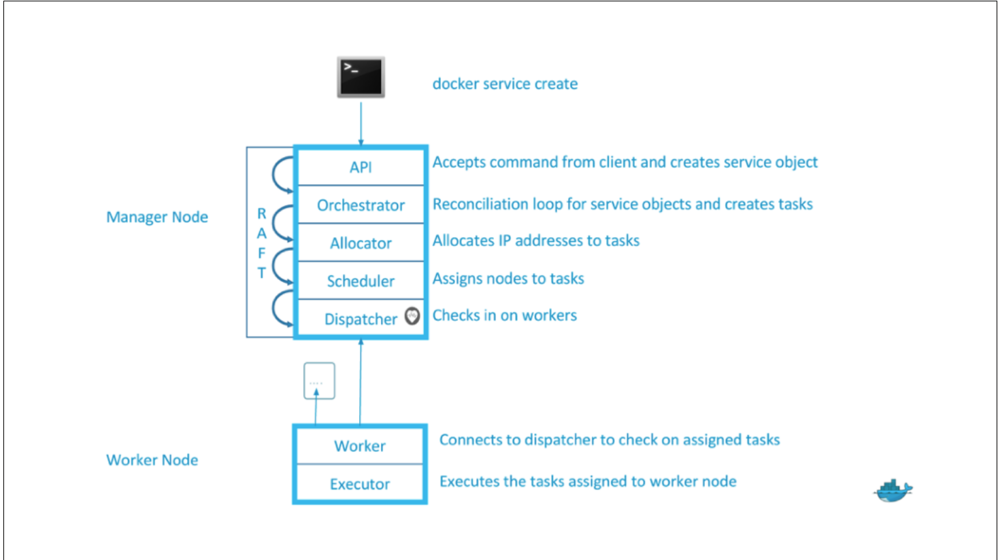
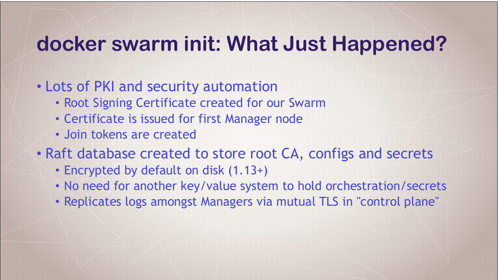

# import_linux_command

</img>

</img>

</img>

</img>

</img>

</img>

</img>

</img>

# Swarm Intro and Creating a 3-Node Swarm Cluster

## Create Your First Service and Scale it Locally
## Command

* docker info

* docker swarm init

* docker node ls

* docker node --help

* docker swarm --help

* docker service --help

* docker service create alpine ping 8.8.8.8

* docker service ls

* docker service ps frosty_newton

* docker container ls

* docker service ls

* docker service update etc25a25dpj7 --replicas 3

* docker service update TAB COMPLETION --replicas 3

* docker service ls

* docker service ps frosty_newton

* docker update --help

* docker service update --help

* docker container ls

* docker container rm -f frosty_newton.1.TAB COMPLETION

* docker service ls

* docker service ps frosty_newton

* docker service rm frosty_newton

* docker service ls

* docker container ls

## Creating a 3-Node Swarm Cluster
## Command
http://play-with-docker.com

* docker info

* docker-machine

* docker-machine create node1

* docker-machine ssh node1

* docker-machine env node1

* docker info

http://get.docker.com

* docker swarm init

* docker swarm init --advertise-addr TAB COMPLETION

* docker node ls

* docker node update --role manager node2

* docker node ls

* docker swarm join-token manager

* docker node ls

* docker service create --replicas 3 alpine ping 8.8.8.8

* docker service ls

* docker node ps

* docker node ps node2

* docker service ps sleepy_brown

## Scaling Out with Overlay Networking
## Command

* docker network create --driver overlay mydrupal

* docker network ls

* docker service create --name psql --netowrk mydrupal -e POSTGRES_PASSWORD=mypass postgres

* docker service ls

* docker service ps psql

* docker container logs psql TAB COMPLETION

* docker service create --name drupal --network mydrupal -p 80:80 drupal

* docker service ls

* watch docker service ls

* docker service ps drupal

* docker service inspect drupal

## Rollback
## Command
* docker service create -p 8088:80 --name web nginx:1.13.7

* docker service scale web=5

* docker service update --image nginx:1.13.6 web

* docker service update --publish-rm 8088 --publish-add 9090:80

* docker service update --force web

# Rmove the service we created
* docker service rm web

# Docker HEakthcheck 

HEakthcheck was added in 1.12

## HEakthcheck Docker Run Example
docker run --heath-cmd="curl -f localhost:9200/_cluster/health || false" --health-interval=5s --health-retries=3 --health-timeout=2s --health-start-period=15s elasticsearch:2

## Option for heakthcheck command
* --interval=DURATION (default:30s)
* --timeout=DURATION (default:30s)
* --start-period=DURATION (default:0s)
* --retries=N (default:3)

 
## Basic command using default options
* HEALTHCHECK curl -f http://localhost/ || false

## Custom options with the command
* HEALTHCHECK --timeoute=2s --interval=3s --retries=3 
* CMD curl -f http://localhost/ || exit 1

## Healthcheck in PHP Nginx Dockerfile
PHP-FPM running behind Nginx, test the Nginx and FPM status URLS 

FROM your-nginx-php-fpm-combo-image

#### don't di this if php-fpm ping/statys in pool,ini
#### must forward/ping and /status urls from nginx to php php-fpm

HEALTHCHECK --interval=5s --timeoute=3s CMD curl -f http://localhost/ping || exit 1

## Healthcheck in postgres Dockerfile
USE a Postgress utility to test for ready state
FROM postgres
# specify real user with -u to prevent error in log 

Healthcheck --interval=5s --timeoute=3s CMD pg_isready -U postgres || exit 1

## Command

* docker container run --name p1 -d nginx

* docker container run --name p2 -d --health-cmd="pg_isready -U nginx || exit 1" nginx

* docker service create --name p1 nginx

* docker service create --name p2 --health-cmd="pg_isready -U nginx || exit 1" nginx
--------------------------------------------------------------------------------------------------------------------------------------------------------------------

# Container Registries: Image Storage and Distribution

## Docker Hub: Digging Deeper

https://hub.docker.com

## Docker Store: What Is It For?

https://store.docker.com

## Docker Cloud: CI/CD and Server Ops

https://cloud.docker.com

https://hub.docker.com

## Understanding Docker Registry

https://github.com/docker/distribution

https://hub.docker.com/registry

## Run a Private Docker Registry

* docker container run -d -p 5000:5000 --name registry registry

* docker container ls

* docker image ls

* docker pull hello-world

* docker run hello-world

* docker tag hello-world 127.0.0.1:5000/hello-world

* docker image ls

* docker push 127.0.0.1:5000/hello-world

* docker image remove hello-world

* docker image remove 127.0.0.1:5000/hello-world

* docker container rm admiring_stallman

* docker image remove 127.0.0.1:5000/hello-world

* docker image ls

* docker pull 127.0.0.1:5000/hello-world:latest

* docker container kill registry

* docker container rm registry

* docker container run -d -p 5000:5000 --name registry -v $(pwd)/registry-data:/var/lib/registry registry TAB COMPLETION

* docker image ls

* docker push 127.0.0.1:5000/hello-world

## Using Docker Registry With Swarm

http://play-with-docker.com

* docker node ls

* docker service create --name registry --publish 5000:5000 registry

* docker service ps registry

* docker pull hello-world

* docker tag hello-world 127.0.0.1:5000/hello-world

* docker push 127.0.0.1:5000/hello-world

* docker pull nginx

* docker tag nginx 127.0.0.1:5000/nginx

* docker push 127.0.0.1:5000/nginx

* docker service create --name nginx -p 80:80 --replicas 5 --detach=false 127.0.0.1:5000/nginx

* docker service ps nginx
{"threads":[{"position":862,"start":0,"end":861,"connection":"closed"},{"position":862,"start":862,"end":1721,"connection":"open"}],"url":"https://a.udemycdn.com/2018-11-07_22-39-39-2ba95e67e63a882c31b7b87c7daef210/original.txt?nva=20191209144631&download=True&filename=DM-S10-Commands.txt&token=0cc5608f6d3f6cfa560a4","method":"GET","port":443,"downloadSize":1721,"headers":{"date":"Tue, 06 Aug 2019 22:23:53 GMT","content-type":"application/force-download","content-length":"1721","connection":"close","etag":"\"545e96789e5dc32c50c6d401bc5a4dae\"","last-modified":"Wed, 07 Nov 2018 22:39:41 GMT","server":"AmazonS3","x-amz-id-2":"1xpUdco8KEPlGre63vhip9HAcc0+0DnKUDWLD9ZB4gvOlca9TXDJBQah9MH45eBSf393sNBa9wk=","x-amz-meta-qqfilename":"DM%20S10%20Commands.txt","x-amz-replication-status":"COMPLETED","x-amz-request-id":"D0D177545391C728","x-amz-version-id":"G9VelkZRJNcf2uNprsoNmrHFjwWEL24R","access-control-allow-origin":"*","age":"10756826","content-disposition":"attachment; filename=\"DM-S10-Commands.txt\"","accept-ranges":"bytes"}} 
