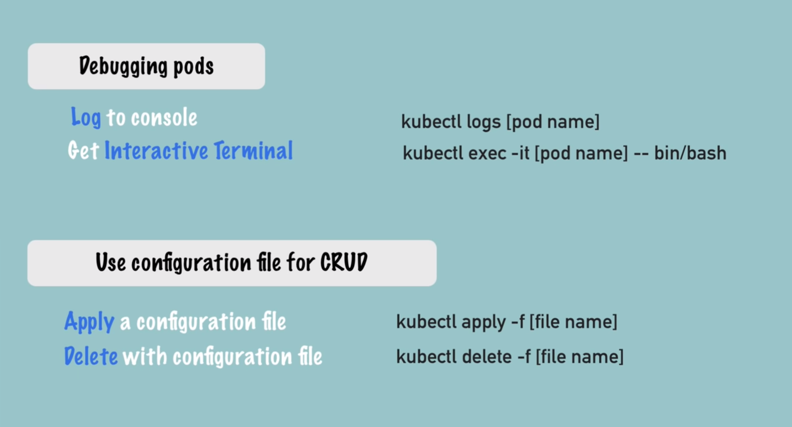
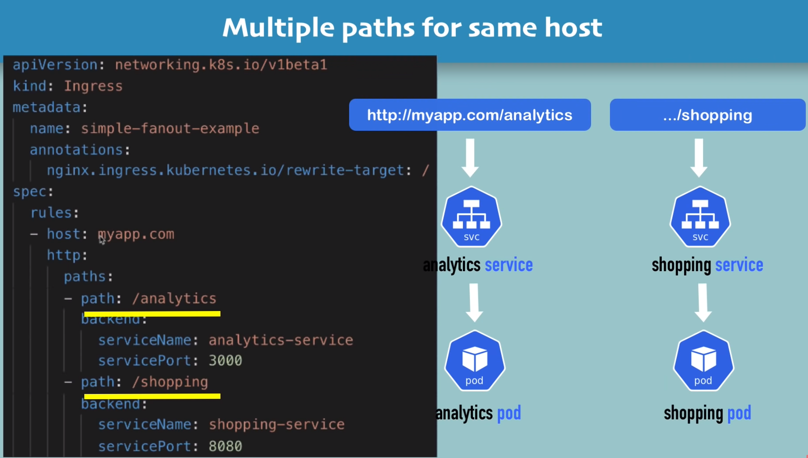

## deployment kubenetes fro

## K8

## install kubectl on Linux
```
curl -LO "https://dl.k8s.io/release/$(curl -L -s https://dl.k8s.io/release/stable.txt)/bin/linux/amd64/kubectl"
curl -LO https://dl.k8s.io/release/v1.24.0/bin/linux/amd64/kubectl
curl -LO "https://dl.k8s.io/$(curl -L -s https://dl.k8s.io/release/stable.txt)/bin/linux/amd64/kubectl.sha256"
echo "$(cat kubectl.sha256)  kubectl" | sha256sum --check
sudo install -o root -g root -m 0755 kubectl /usr/local/bin/kubectl

chmod +x kubectl
mkdir -p ~/.local/bin
mv ./kubectl ~/.local/bin/kubectl
# and then append (or prepend) ~/.local/bin to $PATH

kubectl version --client

```
## minikube start

```
curl -LO https://storage.googleapis.com/minikube/releases/latest/minikube-linux-amd64
sudo install minikube-linux-amd64 /usr/local/bin/minikube
minikube start
or
minikube start --force
```

## import command on k8s server
```
kubectl get pod

kubectl get services
kubectl get deployment
kubectl get replicaset
kubectl logs nginx-depl1.... (pod name) 
kubectl logs
```
## deployment nginx with out yam files
```
kubectl create deployment Name --image=image [--dry-run] [options]
kubrctl create deployment name image option1 opntion2 ...
kubectl create deployment nginx-depl --image=nginx

```
## connect to container 

```
kubectl exec -it podname -- bin/bash
```
## deleteting deployment and pods
```
kubectl get deployment
kubectl get pod

kubectl delete deployment mongo...
kubectl delete deployment nginx
```
## create pod nad container with yam files
```

apiVersion: apps/v1
kind: Deployment
metadata:
  name: nginx-deployment
  labels:
    app: nginx
spec:  #deployment
  replicas: 1
  selector:
    matchLabels:
      app: nginx
  template:
    metadata:
      labels:
        app: nginx
    spec:   #pod
      containers:
        - name: nginx   
          image: nginx:1.16
          ports:
            - containerPort: 80
```
```
kubectl apply -f nginx-deployment.yaml

you can change file and apply again

kubectl get deployment

kubectl get pod
```

```
apiVersion: apps/v1
kind: Deployment
metadata:
  name: my-app
  labels:
    app: my-app
spec:  #deployment
  replicas: 2
  selector:
    matchLabels:
      app: my-app
  template:
    metadata:
      labels:
        app: my-app
    spec:   #pod
      containers:
        - name: my-app    #pod
          image: my-image
          env:
            - name: SOME_ENV
              value: $SOME_ENV
          ports:
            - containerPort: 8080
```
```
kubectl apply -f nginx-service.yaml
```

## get information deployment and pods and services

```
kubectl describe service nginx-service

kubectl get pod -o wide

kubectl get deployment nginx-deployment -o yaml

kubectl get deployment nginx-deployment -o yaml > nginx-deployment-result.yaml
```
## deleting file with yaml file
```
kubectl delete -f nginx-service.yaml 

kubectl delete -f nginx-deployment.yaml
```


## create mongo container and mongoexpree for connectiong mongodb
```
Importand type
* deployment
* service
* configMap
* secret


kubectl get all

```
## make secret for username and password on MongoDB
* create secret keypair
echo -n 'username' | base64
echo -n 'password' | base64
```
vim mongo-secret.yaml


apiVersion: v1
kind: Secret
metadata:
  name: mongodb-secret
type: Opaque  #secret type

data:
  mongo-root-username: dXNlcm5hbWU=
  mongo-root-password: cGFzc3dvcmQ=

```
```
kubectl apply -f mongo-secret.yml
kubectl get secret

```
```
vim mongo.yaml

apiVersion: apps/v1
kind: Deployment
metadata:
  name: mongodb-deployment
  labels:
    app: mongodb
spec:
  replicas: 1
  selector:
    matchLabels:
      app: mongodb
  template:
    metadata:
      labels:
        app: mongodb
    spec:
      containers:
       - name: mongodb
         image: mongo
         ports:
         - containerPort: 27017
         env:
         - name: MONGO_INITDB_ROOT_USERNAME
           valueFrom:
             secretKeyRef:
               name: mongodb-secret
               key: mongo-root-username
         - name: MONGO_INITDB_ROOT_PASSWORD
           valueFrom:
             secretKeyRef:
               name: mongodb-secret
               key: mongo-root-password
---

apiVersion: v1
kind: Service
metadata:
  name: mongodb-service  #service name
spec:
  selector:
    app: mongodb ## conected to the pod
  ports:
  - protocol: TCP   # expose service port
    port: 27017
    targetPort: 27017   # ccontainer or pod port

```
```
kubectl apply -f mongo.yml
kubectl describe service mongodb-service
kubectl get all |grep mongodb
```

```
vim mongo-express.yaml

apiVersion: apps/v1
kind: Deployment
metadata:
  name: mongo-express
  labels:
    app: mongo-express
spec:
  replicas: 1
  selector:
    matchLabels:
      app: mongo-express
  template:
    metadata:
      labels:
        app: mongo-express
    spec:
      containers:
      - name: mongo-express
        image: mongo-express
        # resources:
        #   limits:
        #     memory: "128Mi"
        #     cpu: "500m"
        ports:
        - containerPort: 8081
        env:
        - name: ME_CONFIG_MONGODB_ADMINUSERNAME
          valueFrom:
             secretKeyRef:
               name: mongodb-secret
               key: mongo-root-username
        - name: ME_CONFIG_MONGODB_ADMINPASSWORD
          valueFrom:
             secretKeyRef:
               name: mongodb-secret
               key: mongo-root-password
        - name: ME_CONFIG_MONGODB_SERVER
          valueFrom:
             configMapKeyRef:
               name: mongodb-configmap
               key: database_url

---
## when you run this service you can access mongodb on browser
apiVersion: v1
kind: Service
metadata:
  name: mongo-express-service
spec:
  selector:
    app: mongo-express
  type: LoadBalancer
  ports:
  - protocol: TCP
    port: 8081
    targetPort: 8081
    nodePort:  30000  #30000-32767

```

```
kubectl apply -f mongo-configmap.yaml

kubectl apply -f mongo-express.yaml
```





## namespace 

```
kubectl get namespaces
```
### create namespace
```
kubectl create namespace my-namespace
``` 

### ## create a namespace with a configuration file

```
apiVersion: v1
kind: ConfigMap
metadata:
  name: mongodb-configmap
  namespace: my-namespace
data:
  database_url: mongodb-service
```

## install kubectx 
```
https://github.com/ahmetb/kubectx#installation

sudo git clone https://github.com/ahmetb/kubectx /opt/kubectx
sudo ln -s /opt/kubectx/kubectx /usr/local/bin/kubectx
sudo ln -s /opt/kubectx/kubens /usr/local/bin/kubens
```

## show namespace default on your server
```
kubens
```
## How to change active namespace on your server

```
kubens my-namespace
```


## kubernetes ingress explained

```
minikube addons enable ingress

kubectl get ns

minikube addons enable dashboard


kubectl get all -n kubernetes-dashboard

kubectl get ingress -n kubernetes-dashboard

kubectl describe ingress dashboard-ingress -n kubernetes-dashboard

```




## ssl


