# Kubernetes Training: How to Deploy a Cluster from Scratch

### Install K8s Binaries
The next steps will prepare the VM for kube setup.

* Install Docker:
  
```
apt install docker.io -y
or 
curl -fsSL https://get.docker.com -o get-docker.sh
sh get-docker.sh
```
#### Download and extract the K8s binaries:
```
wget https://storage.googleapis.com/kubernetes-release/release/v1.9.11/kubernetes-server-linux-amd64.tar.gz
tar -xzf kubernetes-server-linux-amd64.tar.gz
```
### Install the K8s binaries:
```
cd kubernetes/server/bin/
mv kubectl kubelet kube-apiserver kube-controller-manager kube-scheduler kube-proxy /usr/bin/
cd
```
### Test that kubectl can now be called:
```
kubectl
```

### Remove unused resources:
```
rm -rf kubernetes kubernetes-server-linux-amd64.tar.gz
```
### Creating the Kube
#### Set up kubelet

* The next steps will get kubelet working and show it in action.
  
Create a directory for kubelet manifests:

```
mkdir -p /etc/kubernetes/manifests
```
### Start kubelet in the background:
```
kubelet --pod-manifest-path /etc/kubernetes/manifests &> /etc/kubernetes/kubelet.log &
```
### Check its status and initial logs:

```
ps -au | grep kubelet
head /etc/kubernetes/kubelet.log
```

### Create a Pod using the kubelet's manifest directory:
```
cat <<EOF > /etc/kubernetes/manifests/kubelet-test.yaml
```
```
apiVersion: v1
kind: Pod
metadata:
  name: kubelet-test
spec:
  containers:
  - name: alpine
    image: alpine
    command: ["/bin/sh", "-c"]
    args: ["while true; do echo SuPeRgIaNt; sleep 15; done"]
```
```
EOF
```
### Verify that kubelet has started the Pod (this may take up to a minute):

```
docker ps
```
### Check the container's logs:
```
docker logs {CONTAINER ID}
```

## Set up etcd

* The next steps will get the kube's database/state store working and show it in action.

### Download and extract etcd and etcdctl:

```
wget https://github.com/etcd-io/etcd/releases/download/v3.2.26/etcd-v3.2.26-linux-amd64.tar.gz
tar -xzf etcd-v3.2.26-linux-amd64.tar.gz
```

### Install the etcd and etcdctl binaries:
```
mv etcd-v3.2.26-linux-amd64/etcd /usr/bin/etcd
mv etcd-v3.2.26-linux-amd64/etcdctl /usr/bin/etcdctl
```

### Remove leftover resources:

```
rm -rf etcd-v3.2.26-linux-amd64 etcd-v3.2.26-linux-amd64.tar.gz
```

### Start etcd:

```
etcd --listen-client-urls http://0.0.0.0:2379 --advertise-client-urls http://localhost:2379 &> /etc/kubernetes/etcd.log &
```

### See if the database is healthy with etcdctl:

```
etcdctl cluster-health
```
### Try to get any resources from the kube:
```
kubectl get all --all-namespaces
```


## Set up kube-apiserver

* The next steps will get the kube's API working and show it in action.

### Start kube-apiserver:

```
kube-apiserver --etcd-servers=http://localhost:2379 --service-cluster-ip-range=10.0.0.0/16 --bind-address=0.0.0.0 --insecure-bind-address=0.0.0.0 &> /etc/kubernetes/apiserver.log &
```

### Check its status and initial logs:

```
ps -au | grep apiserver
head /etc/kubernetes/apiserver.log
```

### Hit an API endpoint to see kube-apiserver respond:
```
curl http://localhost:8080/api/v1/nodes
```

## Set up a kubeconfig File for kubectl

* The next steps will allow kubectl to be properly configured.

### Check to see that kubectl sees the API server:
```
kubectl cluster-info
```

### Add the API server address to a kubeconfig file:
```
kubectl config set-cluster kube-from-scratch --server=http://localhost:8080
kubectl config view
```

### Create a context for kubectl which will point to that apiserver:
```
kubectl config set-context kube-from-scratch --cluster=kube-from-scratch
kubectl config view
```

### Use the context created earlier for kubectl:
```
kubectl config use-context kube-from-scratch
kubectl config view
```
### check that resources can now be seen on the cluster:
```
kubectl get all --all-namespaces
kubectl get no
```

## Set up the New Config for kubelet

* The next steps will take the configuration created and use it to configure kubelet.

### Restart kubelet with a new flag pointing it to the apiserver (this step may fail once or twice, try again):

```
pkill -f kubelet
kubelet --register-node --kubeconfig=".kube/config" &> /etc/kubernetes/kubelet.log &
```
### Check its status and initial logs:

```
ps -au | grep kubelet
head /etc/kubernetes/kubelet.log
```

### Check to see that kubelet has registered as a node:
```
kubectl get no
```
### Check to see the old Pod is not coming up:

```
docker ps
```

### Check that the Pod manifest is still present:
```
ls /etc/kubernetes/manifests
```

### Create a new Pod using kubectl, to test control plane components as they are set up:
```
cat <<EOF > ./kube-test.yaml
```
```
apiVersion: v1
kind: Pod
metadata:
  name: kube-test
  labels:
    app: kube-test
spec:
  containers:
  - name: nginx
    image: nginx
    ports:
    - name:  http
      containerPort: 80
      protocol: TCP
```
```
EOF
```

```
kubectl create -f kube-test.yaml
```
### Check the Pod's status:

```
kubectl get po
```

## Set up kube-scheduler

* The next steps will allow Pods to schedule on the kube.

Start the scheduler:
```
kube-scheduler --master=http://localhost:8080/ &> /etc/kubernetes/scheduler.log &
```
### Check its status and initial logs:
```
ps -au | grep scheduler
head /etc/kubernetes/scheduler.log
```

### Check to see if the Pod was scheduled:

```
kubectl get po
```
### Delete the Pod:


```
kubectl delete po --all
```

### Set up kube-controller-manager

* The next steps will set up a controller-manager for state-enforcment of various things in the kube.

### Create a Deployment:

```
cat <<EOF > ./replica-test.yaml
```
```
apiVersion: apps/v1
kind: Deployment
metadata:
  name: replica-test
spec:
  replicas: 3
  selector:
    matchLabels:
      app: replica-test
  template:
    metadata:
      name: replica-test
      labels:
        app: replica-test
    spec:
      containers:
      - name: nginx
        image: nginx
        ports:
        - name:  http
          containerPort: 80
          protocol: TCP

```

```
EOF
```
```
kubectl create -f replica-test.yaml
```

### Check the Deployment's status:
```
kubectl get deploy
```
### Check that no Pods are Pending for this Deployment:

```
kubectl get po
```
## Start the controller-manager:

```

kube-controller-manager --master=http://localhost:8080 &> /etc/kubernetes/controller-manager.log &
```

### Check its status and initial logs:

```
ps -au | grep controller
head /etc/kubernetes/controller-manager.log
```

### Check the status of the Deployment:

```
kubectl get deploy

```

### Resume and check the rollout of the Deployment, if the number of AVAILABLE Pods still does not change:
```
kubectl rollout resume deploy/replica-test
kubectl rollout status deploy/replica-test
```

### Check the new Pods:
```
kubectl get po
```

## Set up kube-proxy
* The next steps will allow the Deployment to communicate outside of the Docker network in a K8s-compliant manner.

### Create a Service for the replica-test Deployment:
```
cat <<EOF > ./service-test.yaml
```
```
apiVersion: v1
kind: Service
metadata:
  name: replica-test
spec:
  type: ClusterIP
  ports:
  - name: http
    port: 80
  selector:
    app: replica-test
```
```
EOF
```
```
kubectl create -f service-test.yaml
```
### Curl the service to see if any Pod is contacted:
```
kubectl get svc
curl {CLUSTER IP}:80
```
### Start kube-proxy:
```
kube-proxy --master=http://localhost:8080/ &> /etc/kubernetes/proxy.log &
```
### Check its status and initial logs:
```
ps -au | grep proxy
head /etc/kubernetes/proxy.log
```
### Curl the Service again to see if any Pod is contacted:
```
kubectl get svc
curl {CLUSTER IP}:80
```

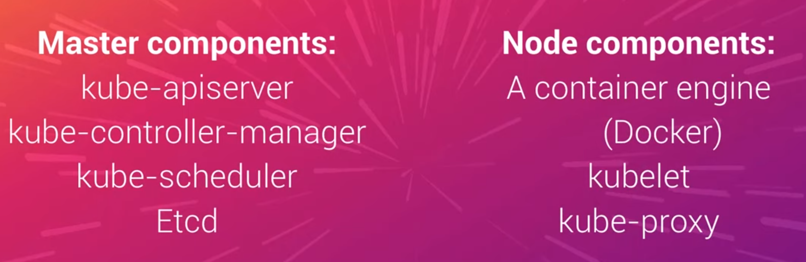
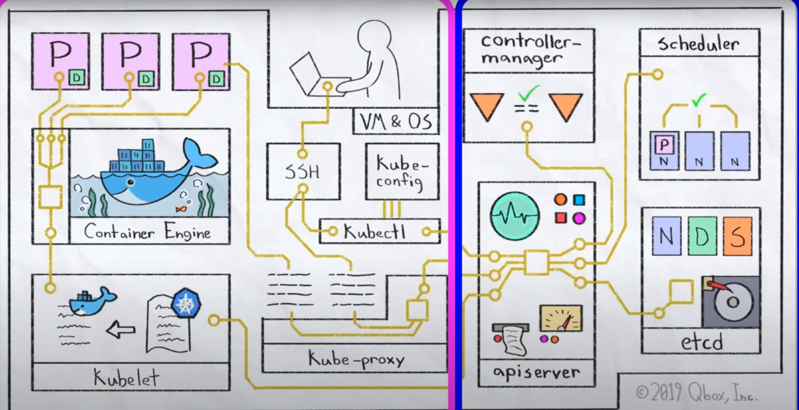
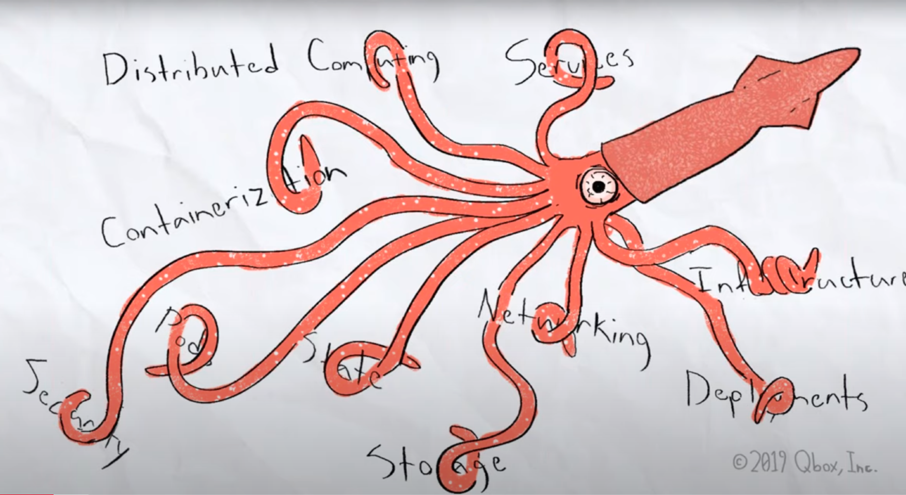
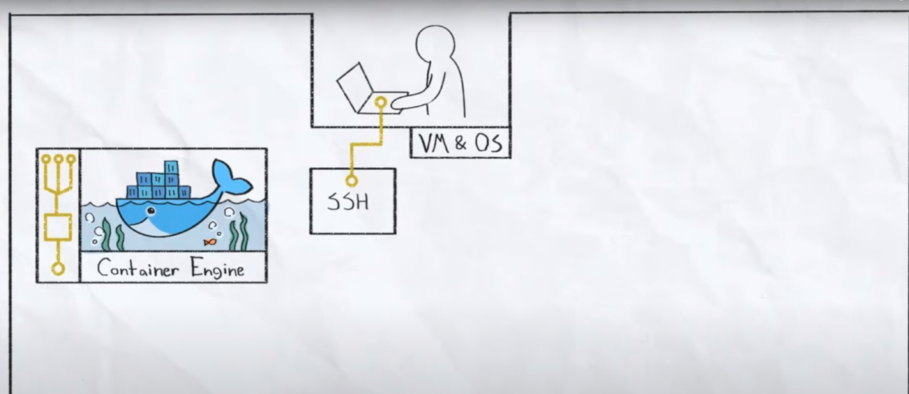
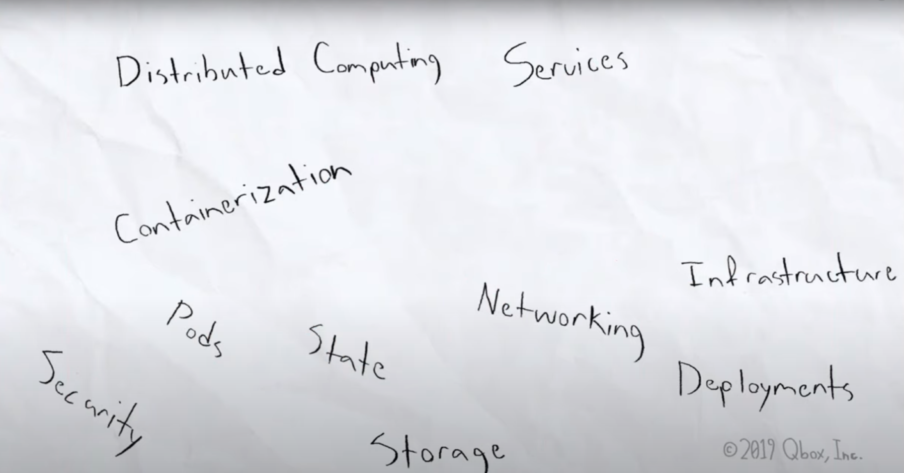
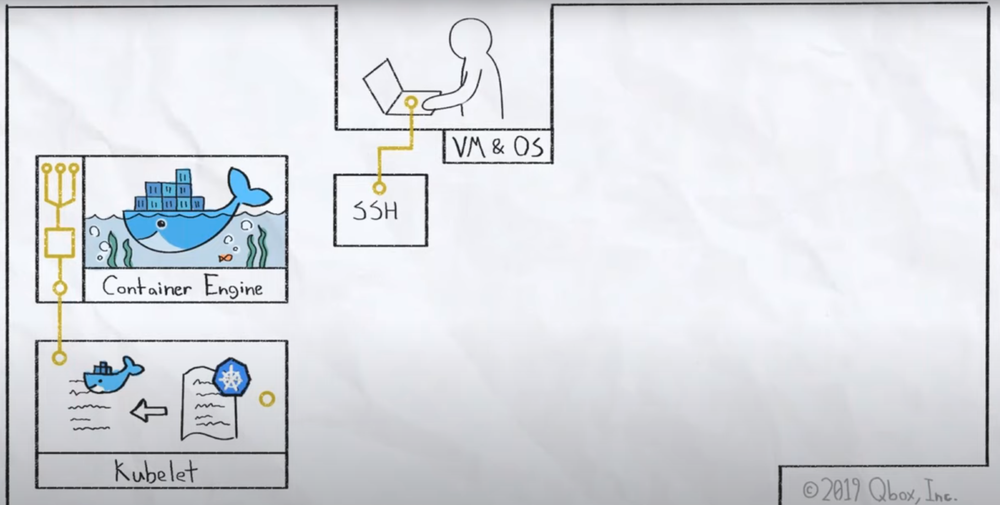
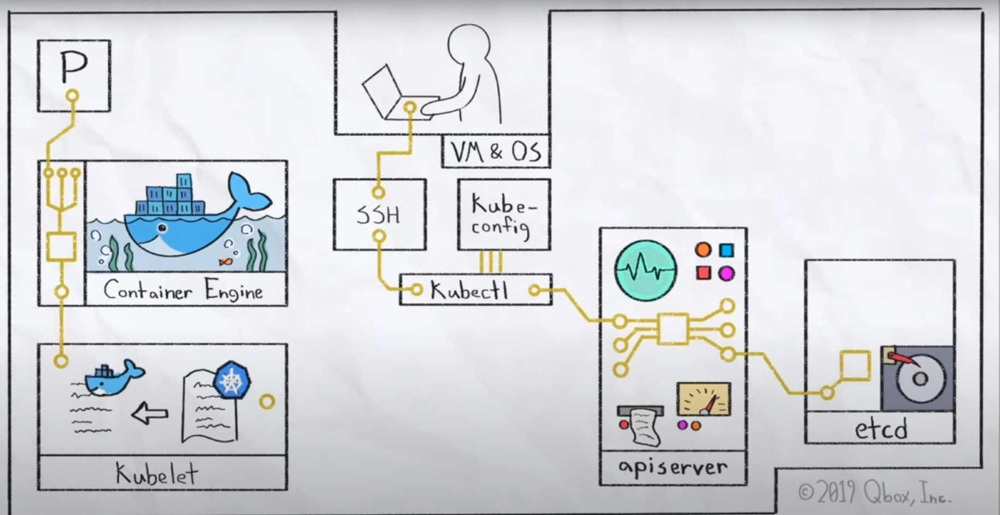
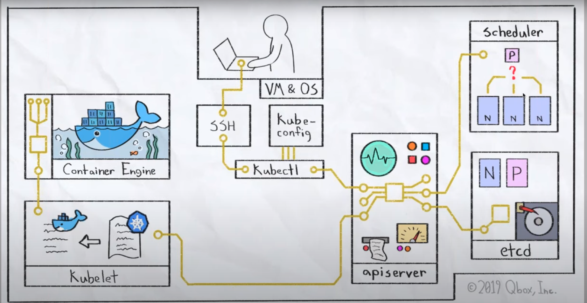
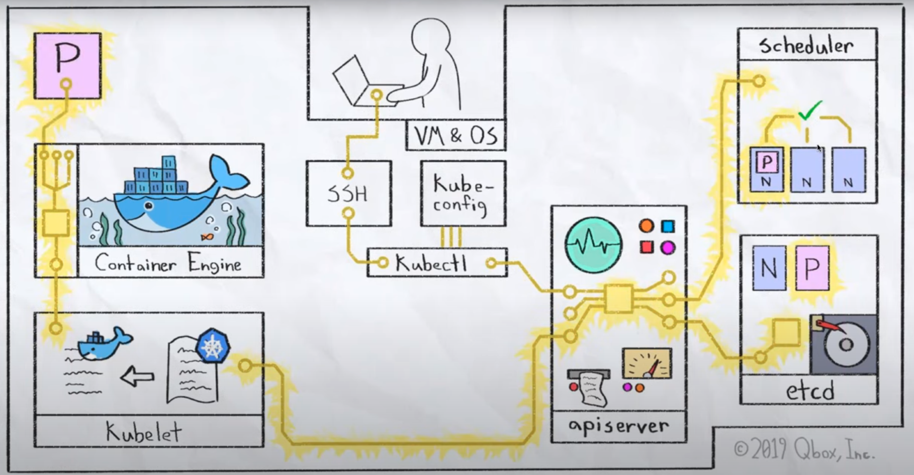
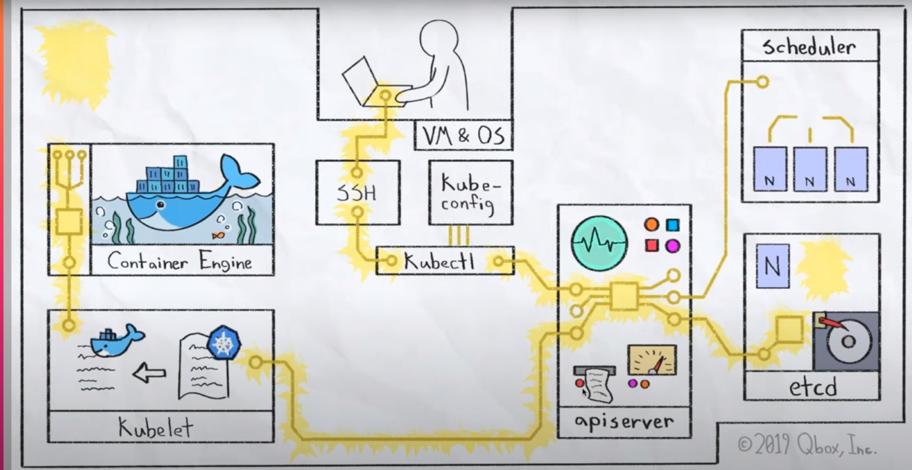
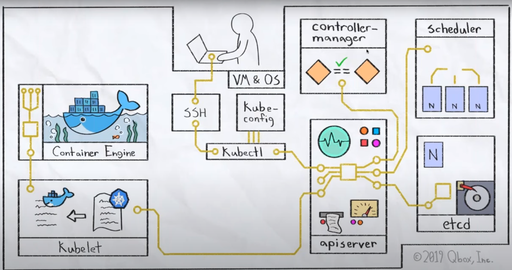
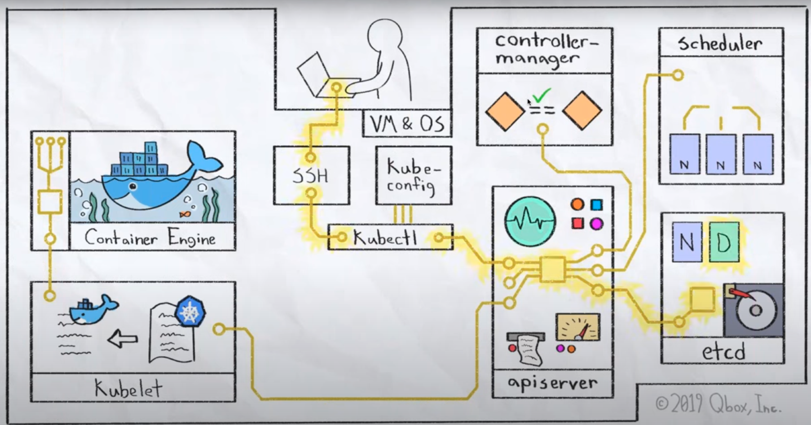
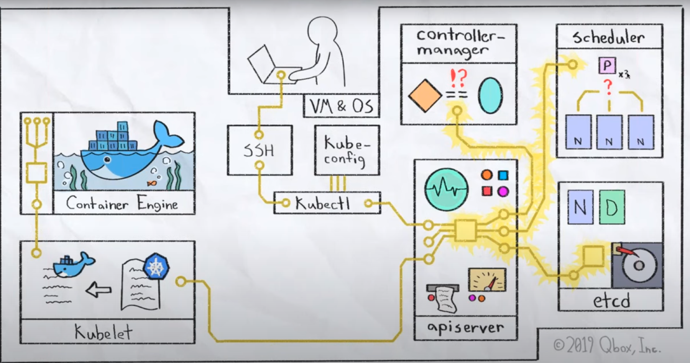
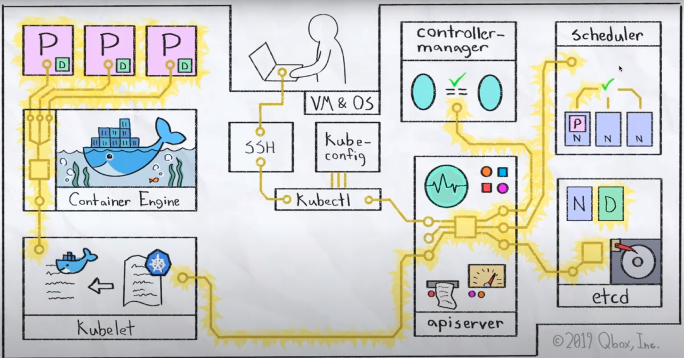
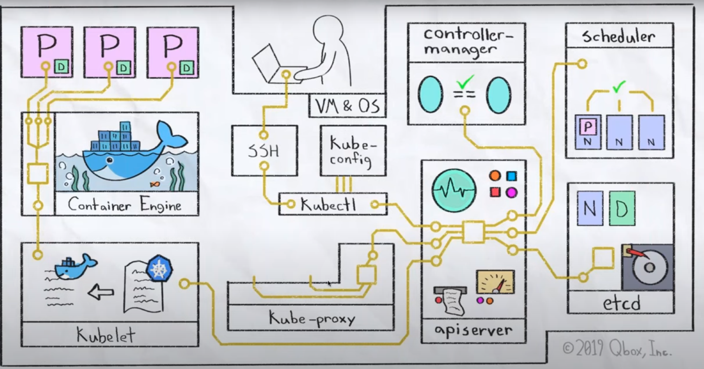
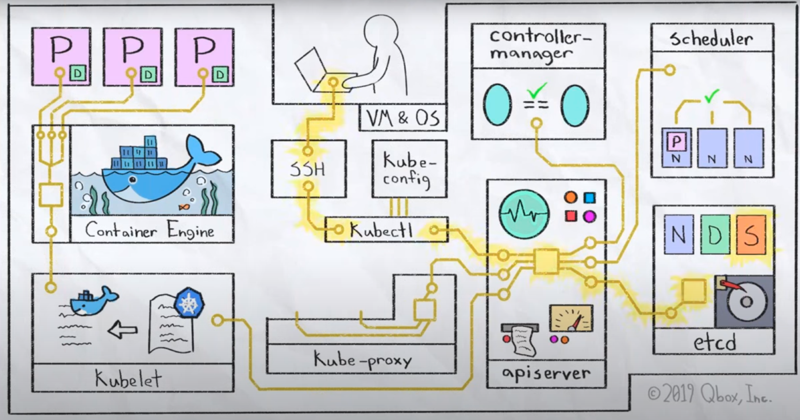
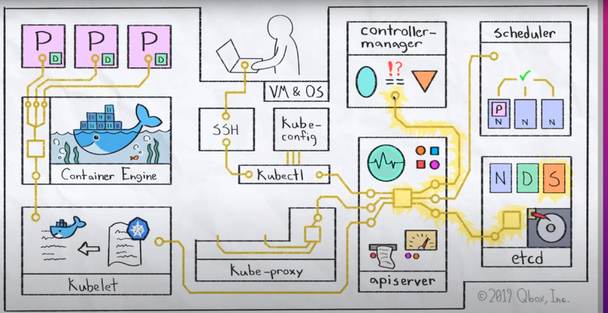
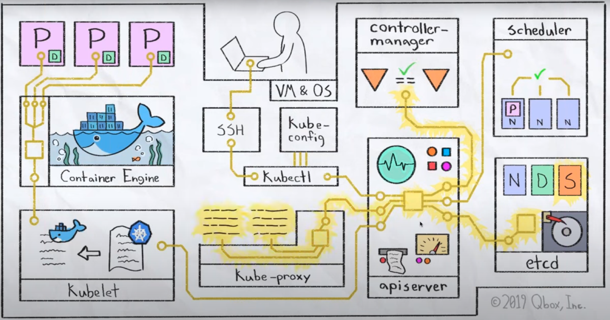


