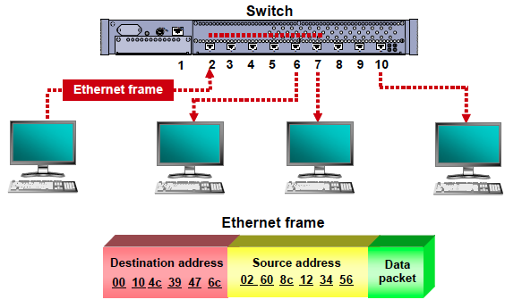
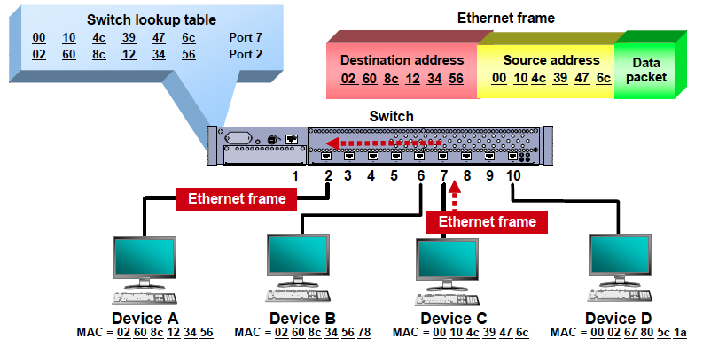
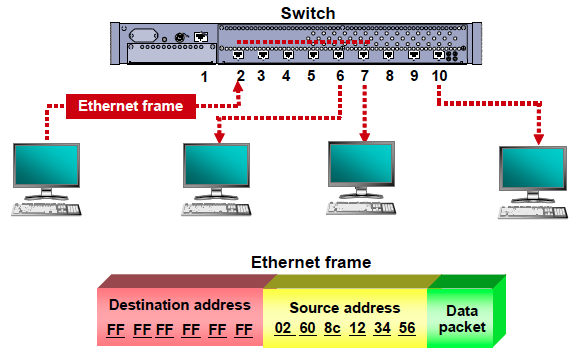
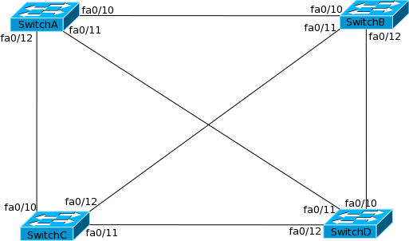

# import_linux_command

Basically, network switches learn, filter, forward and flood Ethernet frames. After taking a switch out the box, plugging it in, and connecting devices to it, the switch goes through the following processes:

</img>

## Learning Process
Learning is the process of obtaining the MAC address of connected devices. When a frame reaches into the port of a switch, the switch reads the MAC address of the source device from Ethernet frame and compares it to its MAC address table (also known as CAM (Content Addressable Memory) table). If the switch cannot find a corresponding entry in MAC address table, the switch will add the address to the table with the port number via the Ethernet frame arrived.

In detail, the switch learning process works like this:

As a PC or other networked device sends a frame to another device through the switch, the switch captures the source MAC address of the frame and the interface that received it.
The switch confirms or adds the MAC address and the port to the lookup table.
A switch also keeps a timer for each of the MAC address entries in its lookup table. By default, many vendors set this time to hold an address entry to 300 seconds (5 minutes). This can be changed if you want. The timer lets the switch get rid of old entries to keep the lookup process short and fast.
The aging timer also helps when a device moves to another switch port. In that case, the address would appear in both places in the lookup tables. When a frame arrives headed for that address, the switch can compare the aging timer for both entries and select the most recent if the entry has not already timed out.

Whenever switch updates an entry in the MAC address table, the switch resets the timer for that entry.

Most often, the initial communication to a switch is an Address Resolution Protocol (ARP) request. The inbound ARP contains the sender’s MAC address, and the switch adds that address to its lookup table. The ARP Response contains the MAC address of the intended target. The ARP response also updates the switch’s lookup table.

</img>

f the device is not listed in the mac table the frame would be “flooded” out all interfaces (except the one it came in on) in hopes that it will reach the correct host. If the host receives the frame and responds, the switch will have learnt the devices mac address and will add it to the table.

All devices are usually assigned to VLAN 1 on most switches (that support VLAN technology), but imagine now that the device with mac address 0000.aa67.64c5 is in VLAN 2. Then the switch will only forward frames that originate in VLAN 2 to that device.

If Inter-VLAN routing is configured, the switch will forward any frame destined for that device but originating in a different VLAN to the default-gateway (router) on that network and the router will move the frame over to VLAN 2 so that the switch now sees it as originating in VLAN 2 and so it can now forward the frame to the above mentioned device in VLAN 2.

So, ss part of the learning process, a switch will flood the single frame out all of its other ports when it cannot find the destination MAC address in the switch’s lookup table.

This flooding process is necessary network overhead. One challenge is that any user at another system attached to the flooding switch that is running a protocol analyzer can see the flooded frame.

</img>

When a switch has learned the locations of the devices connected to it, the switch is ready to either forward or filter frames based on the destination MAC address of the frame and the contents of the switch lookup table.

The switch has already found the port of device A by its MAC address 02 60 8c 12 34 56 and switch port number 2. The switch recognizes device C with a MAC address 00 10 4c 39 47 6c when it replies to port 7 on the switch. The switch will receive the incoming frame, examine the destination address of the Ethernet frame, and check its lookup table. The switch will then make a decision to forward the frame out port 2, and only port 2.

The switch filters out (or does not send the frame to) other ports on the switch since they do not have the target MAC address in the lookup table. That way, no one else can look at the contents of the frame.

If the source MAC address is same as the destination MAC address, the switch will drop the Ethernet frame. This is known as filtering. This will normally happen if there is a hub connected to a port of the switch, and both the source device and destination device are connected to the hub.

</img>

###  Flooding process
A switch also floods all of its other ports under two other circumstances:

If a broadcast frame is received with a destination MAC address ff ff ff ff ff ff, the switch forwards the broadcast frame out all of the other ports. VLAN exceptions to this rule are discussed later in this section.
If a multicast frame is received, the switch forwards the multicast frame (the first byte contains an odd value such as 01 00 50 00 00 09) out all the switch’s remaining ports. VLAN exceptions apply to flooding by limiting it to the same VLAN as the sender.

</img>

The flooding process for broadcast is necessary for protocols such as ARP which maps an IP address to a MAC address via broadcasting. One significant problem with this flooding process occurs when switches in a network are redundantly connected into physical loops. Flooding broadcast frames can cause a “broadcast storm” on a network, causing it to fail.
