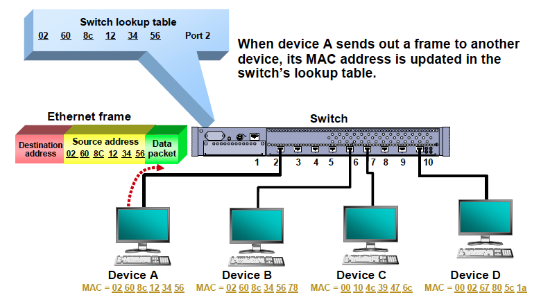

# import_linux_command

Basically, network switches learn, filter, forward and flood Ethernet frames. After taking a switch out the box, plugging it in, and connecting devices to it, the switch goes through the following processes:

</img>

