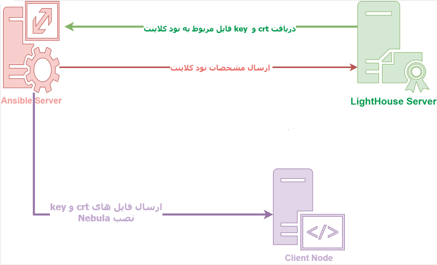
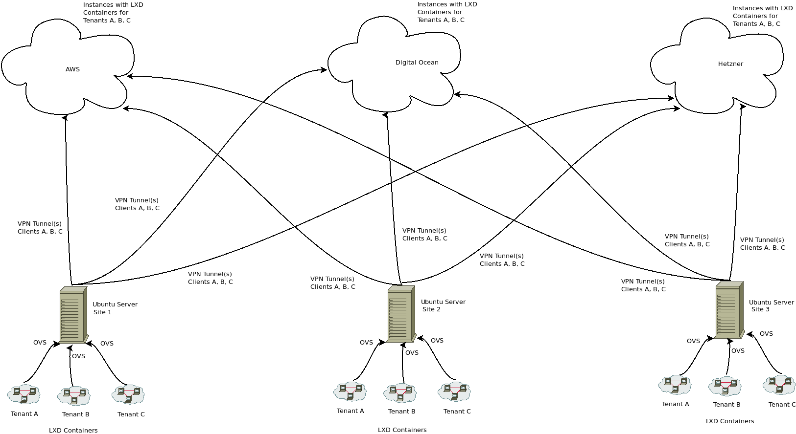

## lighthouse
Nebula is a VPN mesh technology that Slack has created and later open sourced. It is absolutly great for creating an overlay networks between nodes in different locations, whether it's Azure, Amazon, on-prem or in your garage. Even if your nodes are behind a NAT or firewall, Nebula will sprinkle som magic and punch a hole in that sucker.

https://github.com/slackhq/nebula(opens new window)

* Nebula is a scalable overlay networking tool with a focus on performance, simplicity and security. It lets you seamlessly connect computers anywhere  in the world. Nebula is portable, and runs on Linux, OSX, Windows, iOS, and Android. It can be used to connect a small number of computers, but is also able to connect tens of thousands of computers.

The only downside to Nebula is that you'll have to do everything by hand, creating certificates, copying them to the nodes, creating systemd unit files etc. Or you'll have to create the automation your self.

## Getting started

SSH into your Lighthouse node.

Go to the Github project release page (opens new window), download the binaries and extract them..
```
curl -LO https://github.com/slackhq/nebula/releases/download/v1.3.0/nebula-linux-amd64.tar.gz
tar -zxvf nebula-linux-amd64.tar.gz
```
This will unpack two binary files, nebula and nebula-cert. The first is the actual nebula service and the latter is used to create the CA and client certificates. Have a look at step 3 and 4 (opens new window)of the README.md for more information.

Create the certificate authority. Below command creates the ca.crt and ca.key files.

```
./nebula-cert ca -name "Myorganization, Inc"
```

Create a client certificate for the Lighthouse node. Below command will create the lighthouse01.crt and lighthouse01.key files. This is also where you define the Nebula hostname, IP/Subnet and groups.
```
./nebula-cert sign -name lighthouse01 -ip 10.99.0.1/24
```

Create the /etc/nebula directory, move the client certificate and key into it and then move the nebula binary to /usr/local/bin. Also copy the ca.crt to keep it together with the config file.

We'll keep the ca.key and a copy of the ca.crt in the working directory.
```
mkdir /etc/nebula
mv nebula /usr/local/bin
mv lighthouse01.crt lighthouse01.key /etc/nebula
cp ca.crt /etc/nebula

```

## Download the example config file from Github.

```
curl -L -o /etc/nebula/config.yml https://raw.githubusercontent.com/slackhq/nebula/master/examples/config.yml
```
## Lighthouse config
Now we need to edit the config, I will go through the sections that needs to be edited for a minimum setup.
```
vim /etc/nebula/config.yml

```
Change below lines to match the files that got moved to /etc/nebula.
```
pki:
  ca: /etc/nebula/ca.crt
  cert: /etc/nebula/lighthouse01.crt
  key: /etc/nebula/lighthouse01.key
```
Comment out below lines. We dont need them.
```
# static_host_map:
#   "192.168.100.1": ["100.64.22.11:4242"]
```
Change the am_lighthouse property to true and comment out the IP address.
```
lighthouse:
  am_lighthouse: true
  interval: 60
  hosts:
#    - "192.168.100.1"

```
The last part is the IP filter or firewall. You can keep it as is, but maybe comment out or delete the last rule.
```
firewall:
  conntrack:
    tcp_timeout: 12m
    udp_timeout: 3m
    default_timeout: 10m
    max_connections: 100000

  outbound:
    # Allow all outbound traffic from this node
    - port: any
      proto: any
      host: any

  inbound:
    # Allow icmp between any nebula hosts
    - port: any
      proto: icmp
      host: any

     # Allow tcp/443 from any host with BOTH laptop and home group
#    - port: 443
#      proto: tcp
#      groups:
#        - laptop
#        - home
```

## Adding nodes to nebula
Adding nodes is almost the same process as before. Go the working directory, on the Lighthouse node, where nebula-cert is located and create a client certificate for the node.

Remember that its the certificate that determines the hostname, IP address and groups of the node.
```
./nebula-cert sign -name "server1" -ip "10.99.0.2/24" -groups "servers,http"

```
This will create server1.crt and server1.key.

Now repeat the steps.

SSH to the node and create the /etc/nebula directory. Copy the two newly created files and the original Lighthouse ca.crt file to the directory.
Download the config file into /etc/nebula.
Download the Nebula binary and move it the to /usr/local/bin. Remember to set the security context if you are using SELinux.
Download the systemd unit file to /etc/systemd/system/ and do a daemon reload.
Edit the config file which is a bit different than the Lighthouse config.

## Change the paths.
```
pki:
  ca: /etc/nebula/ca.crt
  cert: /etc/nebula/server1.crt
  key: /etc/nebula/server1.key
```

Set a static host map. The 10.99.0.1 is the Nebula IP and the x.x.x.x is the public IP, both belonging to the Lighthouse node.
```
static_host_map:
  "10.99.0.1": ["x.x.x.x:4242"]
```
Change the IP of the hosts property to the Nebula IP of the Lighthouse.
```
lighthouse:
  am_lighthouse: false
  interval: 60
  hosts:
    - "10.99.0.1"
```

Here's an optional step. If you have a lot of interfaces on your node, eg. if you use Docker, you can limit the interfaces that Nebula will try and initiate a handshake on.

```
lighthouse:
  ...
  local_allow_list:
    interfaces:
      eth0: true
```
Last step is to configure the firewall settings. They are pretty self explanatory, here's the example from the default config that allows TCP port 443 from any host with BOTH laptop and home groups
```
firewall:
  ...
  inbound:
    - port: 443
      proto: tcp
      groups:
        - laptop
        - home
```


You can basically read the Github README.md, which will explain how stuff works, so I'm not going to repeat it here.

I will point out though that you need a minimum of one "Lighthouse", a node that is reachable from anywhere. This is the node that will initiate the connections between nodes and which configuration will be slightly different from the others.





## run nebula service
```
mkdir /etc/nebula
cd /etc/nebula

wget -c https://github.com/slackhq/nebula/releases/download/v1.4.0/nebula-linux-amd64.tar.gz


tar -xzf nebula-linux-amd64.tar.gzmkdir /etc/nebula

cd /etc/nebula

wget -c https://github.com/slackhq/nebula/releases/download/v1.4.0/nebula-linux-amd64.tar.gz


tar -xzf nebula-linux-amd64.tar.gz


./nebula-cert ca -name "GreenWeb CA"


./nebula-cert sign -name "lighthouse1" -ip "192.168.100.1/24"  # server lighthouse

./nebula-cert sign -name "client" -ip "192.168.100.2/24"   ## client


curl -o config.yml https://raw.githubusercontent.com/slackhq/nebula/master/examples/config.yml
```
vim config.yml 

```
# This is the nebula example configuration file. You must edit, at a minimum, the static_host_map, lighthouse, and firewall sections
# Some options in this file are HUPable, including the pki section. (A HUP will reload credentials from disk without affecting existing tunnels)

# PKI defines the location of credentials for this node. Each of these can also be inlined by using the yaml ": |" syntax.
pki:
  # The CAs that are accepted by this node. Must contain one or more certificates created by 'nebula-cert ca'
  ca: /etc/nebula/ca.crt
  cert: /etc/nebula/lighthouse1.crt
  key: /etc/nebula/lighthouse1.key
  # blocklist is a list of certificate fingerprints that we will refuse to talk to
  #blocklist:
  #  - c99d4e650533b92061b09918e838a5a0a6aaee21eed1d12fd937682865936c72
  # disconnect_invalid is a toggle to force a client to be disconnected if the certificate is expired or invalid.
  #disconnect_invalid: false

# The static host map defines a set of hosts with fixed IP addresses on the internet (or any network).
# A host can have multiple fixed IP addresses defined here, and nebula will try each when establishing a tunnel.
# The syntax is:
#   "{nebula ip}": ["{routable ip/dns name}:{routable port}"]
# Example, if your lighthouse has the nebula IP of 192.168.100.1 and has the real ip address of 100.64.22.11 and runs on port 4242:
static_host_map:
  "192.168.100.1": ["185.213.164.52:4242"]


lighthouse:
  # am_lighthouse is used to enable lighthouse functionality for a node. This should ONLY be true on nodes
  # you have configured to be lighthouses in your network
  am_lighthouse: true
  #false
  # serve_dns optionally starts a dns listener that responds to various queries and can even be
  # delegated to for resolution
  #serve_dns: false
  #dns:
    # The DNS host defines the IP to bind the dns listener to. This also allows binding to the nebula node IP.
    #host: 0.0.0.0
    #port: 53
  # interval is the number of seconds between updates from this node to a lighthouse.
  # during updates, a node sends information about its current IP addresses to each node.
  interval: 60
  # hosts is a list of lighthouse hosts this node should report to and query from
  # IMPORTANT: THIS SHOULD BE EMPTY ON LIGHTHOUSE NODES
  # IMPORTANT2: THIS SHOULD BE LIGHTHOUSES' NEBULA IPs, NOT LIGHTHOUSES' REAL ROUTABLE IPs
  hosts:
    - "192.168.100.1"

  # remote_allow_list allows you to control ip ranges that this node will
  # consider when handshaking to another node. By default, any remote IPs are
  # allowed. You can provide CIDRs here with `true` to allow and `false` to
  # deny. The most specific CIDR rule applies to each remote. If all rules are
  # "allow", the default will be "deny", and vice-versa. If both "allow" and
  # "deny" rules are present, then you MUST set a rule for "0.0.0.0/0" as the
  # default.
  #remote_allow_list:
    # Example to block IPs from this subnet from being used for remote IPs.
    #"172.16.0.0/12": false

    # A more complicated example, allow public IPs but only private IPs from a specific subnet
    #"0.0.0.0/0": true
    #"10.0.0.0/8": false
    #"10.42.42.0/24": true

  # EXPERIMENTAL: This option my change or disappear in the future.
  # Optionally allows the definition of remote_allow_list blocks
  # specific to an inside VPN IP CIDR.
  #remote_allow_ranges:
    # This rule would only allow only private IPs for this VPN range
    #"10.42.42.0/24":
      #"192.168.0.0/16": true

  # local_allow_list allows you to filter which local IP addresses we advertise
  # to the lighthouses. This uses the same logic as `remote_allow_list`, but
  # additionally, you can specify an `interfaces` map of regular expressions
  # to match against interface names. The regexp must match the entire name.
  # All interface rules must be either true or false (and the default will be
  # the inverse). CIDR rules are matched after interface name rules.
  # Default is all local IP addresses.
  #local_allow_list:
    # Example to block tun0 and all docker interfaces.
    #interfaces:
      #tun0: false
      #'docker.*': false
    # Example to only advertise this subnet to the lighthouse.
    #"10.0.0.0/8": true

  # advertise_addrs are routable addresses that will be included along with discovered addresses to report to the
  # lighthouse, the format is "ip:port". `port` can be `0`, in which case the actual listening port will be used in its
  # place, useful if `listen.port` is set to 0.
  # This option is mainly useful when there are static ip addresses the host can be reached at that nebula can not
  # typically discover on its own. Examples being port forwarding or multiple paths to the internet.
  #advertise_addrs:
    #- "1.1.1.1:4242"
    #- "1.2.3.4:0" # port will be replaced with the real listening port

# Port Nebula will be listening on. The default here is 4242. For a lighthouse node, the port should be defined,
# however using port 0 will dynamically assign a port and is recommended for roaming nodes.
listen:
  # To listen on both any ipv4 and ipv6 use "[::]"
  host: 0.0.0.0
  port: 4242
  # Sets the max number of packets to pull from the kernel for each syscall (under systems that support recvmmsg)
  # default is 64, does not support reload
  #batch: 64
  # Configure socket buffers for the udp side (outside), leave unset to use the system defaults. Values will be doubled by the kernel
  # Default is net.core.rmem_default and net.core.wmem_default (/proc/sys/net/core/rmem_default and /proc/sys/net/core/rmem_default)
  # Maximum is limited by memory in the system, SO_RCVBUFFORCE and SO_SNDBUFFORCE is used to avoid having to raise the system wide
  # max, net.core.rmem_max and net.core.wmem_max
  #read_buffer: 10485760
  #write_buffer: 10485760

# EXPERIMENTAL: This option is currently only supported on linux and may
# change in future minor releases.
#
# Routines is the number of thread pairs to run that consume from the tun and UDP queues.
# Currently, this defaults to 1 which means we have 1 tun queue reader and 1
# UDP queue reader. Setting this above one will set IFF_MULTI_QUEUE on the tun
# device and SO_REUSEPORT on the UDP socket to allow multiple queues.
#routines: 1

punchy:
  # Continues to punch inbound/outbound at a regular interval to avoid expiration of firewall nat mappings
  punch: true

  # respond means that a node you are trying to reach will connect back out to you if your hole punching fails
  # this is extremely useful if one node is behind a difficult nat, such as a symmetric NAT
  # Default is false
  #respond: true

  # delays a punch response for misbehaving NATs, default is 1 second, respond must be true to take effect
  #delay: 1s

# Cipher allows you to choose between the available ciphers for your network. Options are chachapoly or aes
# IMPORTANT: this value must be identical on ALL NODES/LIGHTHOUSES. We do not/will not support use of different ciphers simultaneously!
#cipher: chachapoly

# Preferred ranges is used to define a hint about the local network ranges, which speeds up discovering the fastest
# path to a network adjacent nebula node.
# NOTE: the previous option "local_range" only allowed definition of a single range
# and has been deprecated for "preferred_ranges"
#preferred_ranges: ["172.16.0.0/24"]

# sshd can expose informational and administrative functions via ssh this is a
#sshd:
  # Toggles the feature
  #enabled: true
  # Host and port to listen on, port 22 is not allowed for your safety
  #listen: 127.0.0.1:2222
  # A file containing the ssh host private key to use
  # A decent way to generate one: ssh-keygen -t ed25519 -f ssh_host_ed25519_key -N "" < /dev/null
  #host_key: ./ssh_host_ed25519_key
  # A file containing a list of authorized public keys
  #authorized_users:
    #- user: steeeeve
      # keys can be an array of strings or single string
      #keys:
        #- "ssh public key string"

# Configure the private interface. Note: addr is baked into the nebula certificate
tun:
  # When tun is disabled, a lighthouse can be started without a local tun interface (and therefore without root)
  disabled: false
  # Name of the device. If not set, a default will be chosen by the OS.
  # For macOS: if set, must be in the form `utun[0-9]+`.
  # For FreeBSD: Required to be set, must be in the form `tun[0-9]+`.
  dev: nebula1
  #interface in nebula
  # Toggles forwarding of local broadcast packets, the address of which depends on the ip/mask encoded in pki.cert
  drop_local_broadcast: false
  # Toggles forwarding of multicast packets
  drop_multicast: false
  # Sets the transmit queue length, if you notice lots of transmit drops on the tun it may help to raise this number. Default is 500
  tx_queue: 500
  # Default MTU for every packet, safe setting is (and the default) 1300 for internet based traffic
  mtu: 1300
  # Route based MTU overrides, you have known vpn ip paths that can support larger MTUs you can increase/decrease them here
  routes:
    #- mtu: 8800
    #  route: 10.0.0.0/16
  # Unsafe routes allows you to route traffic over nebula to non-nebula nodes
  # Unsafe routes should be avoided unless you have hosts/services that cannot run nebula
  # NOTE: The nebula certificate of the "via" node *MUST* have the "route" defined as a subnet in its certificate
  # `mtu` will default to tun mtu if this option is not specified
  # `metric` will default to 0 if this option is not specified
  unsafe_routes:
    #- route: 172.16.1.0/24
    #  via: 192.168.100.99
    #  mtu: 1300
    #  metric: 100


# TODO
# Configure logging level
logging:
  # panic, fatal, error, warning, info, or debug. Default is info
  level: info
  # json or text formats currently available. Default is text
  format: text
  # Disable timestamp logging. useful when output is redirected to logging system that already adds timestamps. Default is false
  #disable_timestamp: true
  # timestamp format is specified in Go time format, see:
  #     https://golang.org/pkg/time/#pkg-constants
  # default when `format: json`: "2006-01-02T15:04:05Z07:00" (RFC3339)
  # default when `format: text`:
  #     when TTY attached: seconds since beginning of execution
  #     otherwise: "2006-01-02T15:04:05Z07:00" (RFC3339)
  # As an example, to log as RFC3339 with millisecond precision, set to:
  #timestamp_format: "2006-01-02T15:04:05.000Z07:00"

#stats:
  #type: graphite
  #prefix: nebula
  #protocol: tcp
  #host: 127.0.0.1:9999
  #interval: 10s

  #type: prometheus
  #listen: 127.0.0.1:8080
  #path: /metrics
  #namespace: prometheusns
  #subsystem: nebula
  #interval: 10s

  # enables counter metrics for meta packets
  #   e.g.: `messages.tx.handshake`
  # NOTE: `message.{tx,rx}.recv_error` is always emitted
  #message_metrics: false

  # enables detailed counter metrics for lighthouse packets
  #   e.g.: `lighthouse.rx.HostQuery`
  #lighthouse_metrics: false

# Handshake Manager Settings
#handshakes:
  # Handshakes are sent to all known addresses at each interval with a linear backoff,
  # Wait try_interval after the 1st attempt, 2 * try_interval after the 2nd, etc, until the handshake is older than timeout
  # A 100ms interval with the default 10 retries will give a handshake 5.5 seconds to resolve before timing out
  #try_interval: 100ms
  #retries: 20
  # trigger_buffer is the size of the buffer channel for quickly sending handshakes
  # after receiving the response for lighthouse queries
  #trigger_buffer: 64


# Nebula security group configuration
firewall:
  conntrack:
    tcp_timeout: 12m
    udp_timeout: 3m
    default_timeout: 10m
    max_connections: 100000

  # The firewall is default deny. There is no way to write a deny rule.
  # Rules are comprised of a protocol, port, and one or more of host, group, or CIDR
  # Logical evaluation is roughly: port AND proto AND (ca_sha OR ca_name) AND (host OR group OR groups OR cidr)
  # - port: Takes `0` or `any` as any, a single number `80`, a range `200-901`, or `fragment` to match second and further fragments of fragmented packets (since there is no port available).
  #   code: same as port but makes more sense when talking about ICMP, TODO: this is not currently implemented in a way that works, use `any`
  #   proto: `any`, `tcp`, `udp`, or `icmp`
  #   host: `any` or a literal hostname, ie `test-host`
  #   group: `any` or a literal group name, ie `default-group`
  #   groups: Same as group but accepts a list of values. Multiple values are AND'd together and a certificate would have to contain all groups to pass
  #   cidr: a CIDR, `0.0.0.0/0` is any.
  #   ca_name: An issuing CA name
  #   ca_sha: An issuing CA shasum

  outbound:
    # Allow all outbound traffic from this node
    - port: any
      proto: any
      host: any

  inbound:
    # Allow icmp between any nebula hosts
    - port: any
      proto: icmp
      host: any

    # Allow tcp/443 from any host with BOTH laptop and home group
    ###    - port: 443
    ###  proto: tcp
    ###  groups:
    ###    - laptop
    ###    - home

```

## scp key and cert to Client
```
scp ca.crt client.crt client.key root@185.213.164.24:/etc/nebula/
```


## Client
‍‍‍
```
mkdir /etc/nebula

cd /etc/nebula

wget -c https://github.com/slackhq/nebula/releases/download/v1.4.0/nebula-linux-amd64.tar.gz

tar -xzf nebula-linux-amd64.tar.gz

curl -o config.yml https://raw.githubusercontent.com/slackhq/nebula/master/examples/config.yml
```
vim config.yml
```
# This is the nebula example configuration file. You must edit, at a minimum, the static_host_map, lighthouse, and firewall sections
# Some options in this file are HUPable, including the pki section. (A HUP will reload credentials from disk without affecting existing tunnels)

# PKI defines the location of credentials for this node. Each of these can also be inlined by using the yaml ": |" syntax.
pki:
  # The CAs that are accepted by this node. Must contain one or more certificates created by 'nebula-cert ca'
  ca: /etc/nebula/ca.crt
  cert: /etc/nebula/client.crt
  key: /etc/nebula/client.key
  # blocklist is a list of certificate fingerprints that we will refuse to talk to
  #blocklist:
  #  - c99d4e650533b92061b09918e838a5a0a6aaee21eed1d12fd937682865936c72
  # disconnect_invalid is a toggle to force a client to be disconnected if the certificate is expired or invalid.
  #disconnect_invalid: false

# The static host map defines a set of hosts with fixed IP addresses on the internet (or any network).
# A host can have multiple fixed IP addresses defined here, and nebula will try each when establishing a tunnel.
# The syntax is:
#   "{nebula ip}": ["{routable ip/dns name}:{routable port}"]
# Example, if your lighthouse has the nebula IP of 192.168.100.1 and has the real ip address of 100.64.22.11 and runs on port 4242:
static_host_map:
  "192.168.100.1": ["185.213.164.52:4242"]


lighthouse:
  # am_lighthouse is used to enable lighthouse functionality for a node. This should ONLY be true on nodes
  # you have configured to be lighthouses in your network
  am_lighthouse: false
  # serve_dns optionally starts a dns listener that responds to various queries and can even be
  # delegated to for resolution
  #serve_dns: false
  #dns:
    # The DNS host defines the IP to bind the dns listener to. This also allows binding to the nebula node IP.
    #host: 0.0.0.0
    #port: 53
  # interval is the number of seconds between updates from this node to a lighthouse.
  # during updates, a node sends information about its current IP addresses to each node.
  interval: 60
  # hosts is a list of lighthouse hosts this node should report to and query from
  # IMPORTANT: THIS SHOULD BE EMPTY ON LIGHTHOUSE NODES
  # IMPORTANT2: THIS SHOULD BE LIGHTHOUSES' NEBULA IPs, NOT LIGHTHOUSES' REAL ROUTABLE IPs
  hosts:
    - "192.168.100.1"

  # remote_allow_list allows you to control ip ranges that this node will
  # consider when handshaking to another node. By default, any remote IPs are
  # allowed. You can provide CIDRs here with `true` to allow and `false` to
  # deny. The most specific CIDR rule applies to each remote. If all rules are
  # "allow", the default will be "deny", and vice-versa. If both "allow" and
  # "deny" rules are present, then you MUST set a rule for "0.0.0.0/0" as the
  # default.
  #remote_allow_list:
    # Example to block IPs from this subnet from being used for remote IPs.
    #"172.16.0.0/12": false

    # A more complicated example, allow public IPs but only private IPs from a specific subnet
    #"0.0.0.0/0": true
    #"10.0.0.0/8": false
    #"10.42.42.0/24": true

  # EXPERIMENTAL: This option my change or disappear in the future.
  # Optionally allows the definition of remote_allow_list blocks
  # specific to an inside VPN IP CIDR.
  #remote_allow_ranges:
    # This rule would only allow only private IPs for this VPN range
    #"10.42.42.0/24":
      #"192.168.0.0/16": true

  # local_allow_list allows you to filter which local IP addresses we advertise
  # to the lighthouses. This uses the same logic as `remote_allow_list`, but
  # additionally, you can specify an `interfaces` map of regular expressions
  # to match against interface names. The regexp must match the entire name.
  # All interface rules must be either true or false (and the default will be
  # the inverse). CIDR rules are matched after interface name rules.
  # Default is all local IP addresses.
  #local_allow_list:
    # Example to block tun0 and all docker interfaces.
    #interfaces:
      #tun0: false
      #'docker.*': false
    # Example to only advertise this subnet to the lighthouse.
    #"10.0.0.0/8": true

  # advertise_addrs are routable addresses that will be included along with discovered addresses to report to the
  # lighthouse, the format is "ip:port". `port` can be `0`, in which case the actual listening port will be used in its
  # place, useful if `listen.port` is set to 0.
  # This option is mainly useful when there are static ip addresses the host can be reached at that nebula can not
  # typically discover on its own. Examples being port forwarding or multiple paths to the internet.
  #advertise_addrs:
    #- "1.1.1.1:4242"
    #- "1.2.3.4:0" # port will be replaced with the real listening port

# Port Nebula will be listening on. The default here is 4242. For a lighthouse node, the port should be defined,
# however using port 0 will dynamically assign a port and is recommended for roaming nodes.
listen:
  # To listen on both any ipv4 and ipv6 use "[::]"
  host: 0.0.0.0
  port: 4242
  # Sets the max number of packets to pull from the kernel for each syscall (under systems that support recvmmsg)
  # default is 64, does not support reload
  #batch: 64
  # Configure socket buffers for the udp side (outside), leave unset to use the system defaults. Values will be doubled by the kernel
  # Default is net.core.rmem_default and net.core.wmem_default (/proc/sys/net/core/rmem_default and /proc/sys/net/core/rmem_default)
  # Maximum is limited by memory in the system, SO_RCVBUFFORCE and SO_SNDBUFFORCE is used to avoid having to raise the system wide
  # max, net.core.rmem_max and net.core.wmem_max
  #read_buffer: 10485760
  #write_buffer: 10485760

# EXPERIMENTAL: This option is currently only supported on linux and may
# change in future minor releases.
#
# Routines is the number of thread pairs to run that consume from the tun and UDP queues.
# Currently, this defaults to 1 which means we have 1 tun queue reader and 1
# UDP queue reader. Setting this above one will set IFF_MULTI_QUEUE on the tun
# device and SO_REUSEPORT on the UDP socket to allow multiple queues.
#routines: 1

punchy:
  # Continues to punch inbound/outbound at a regular interval to avoid expiration of firewall nat mappings
  punch: true

  # respond means that a node you are trying to reach will connect back out to you if your hole punching fails
  # this is extremely useful if one node is behind a difficult nat, such as a symmetric NAT
  # Default is false
  #respond: true

  # delays a punch response for misbehaving NATs, default is 1 second, respond must be true to take effect
  #delay: 1s

# Cipher allows you to choose between the available ciphers for your network. Options are chachapoly or aes
# IMPORTANT: this value must be identical on ALL NODES/LIGHTHOUSES. We do not/will not support use of different ciphers simultaneously!
#cipher: chachapoly

# Preferred ranges is used to define a hint about the local network ranges, which speeds up discovering the fastest
# path to a network adjacent nebula node.
# NOTE: the previous option "local_range" only allowed definition of a single range
# and has been deprecated for "preferred_ranges"
#preferred_ranges: ["172.16.0.0/24"]

# sshd can expose informational and administrative functions via ssh this is a
#sshd:
  # Toggles the feature
  #enabled: true
  # Host and port to listen on, port 22 is not allowed for your safety
  #listen: 127.0.0.1:2222
  # A file containing the ssh host private key to use
  # A decent way to generate one: ssh-keygen -t ed25519 -f ssh_host_ed25519_key -N "" < /dev/null
  #host_key: ./ssh_host_ed25519_key
  # A file containing a list of authorized public keys
  #authorized_users:
    #- user: steeeeve
      # keys can be an array of strings or single string
      #keys:
        #- "ssh public key string"

# Configure the private interface. Note: addr is baked into the nebula certificate
tun:
  # When tun is disabled, a lighthouse can be started without a local tun interface (and therefore without root)
  disabled: false
  # Name of the device. If not set, a default will be chosen by the OS.
  # For macOS: if set, must be in the form `utun[0-9]+`.
  # For FreeBSD: Required to be set, must be in the form `tun[0-9]+`.
  dev: nebula1
  # Toggles forwarding of local broadcast packets, the address of which depends on the ip/mask encoded in pki.cert
  drop_local_broadcast: false
  # Toggles forwarding of multicast packets
  drop_multicast: false
  # Sets the transmit queue length, if you notice lots of transmit drops on the tun it may help to raise this number. Default is 500
  tx_queue: 500
  # Default MTU for every packet, safe setting is (and the default) 1300 for internet based traffic
  mtu: 1300
  # Route based MTU overrides, you have known vpn ip paths that can support larger MTUs you can increase/decrease them here
  routes:
    #- mtu: 8800
    #  route: 10.0.0.0/16
  # Unsafe routes allows you to route traffic over nebula to non-nebula nodes
  # Unsafe routes should be avoided unless you have hosts/services that cannot run nebula
  # NOTE: The nebula certificate of the "via" node *MUST* have the "route" defined as a subnet in its certificate
  # `mtu` will default to tun mtu if this option is not specified
  # `metric` will default to 0 if this option is not specified
  unsafe_routes:
    #- route: 172.16.1.0/24
    #  via: 192.168.100.99
    #  mtu: 1300
    #  metric: 100


# TODO
# Configure logging level
logging:
  # panic, fatal, error, warning, info, or debug. Default is info
  level: info
  # json or text formats currently available. Default is text
  format: text
  # Disable timestamp logging. useful when output is redirected to logging system that already adds timestamps. Default is false
  #disable_timestamp: true
  # timestamp format is specified in Go time format, see:
  #     https://golang.org/pkg/time/#pkg-constants
  # default when `format: json`: "2006-01-02T15:04:05Z07:00" (RFC3339)
  # default when `format: text`:
  #     when TTY attached: seconds since beginning of execution
  #     otherwise: "2006-01-02T15:04:05Z07:00" (RFC3339)
  # As an example, to log as RFC3339 with millisecond precision, set to:
  #timestamp_format: "2006-01-02T15:04:05.000Z07:00"

#stats:
  #type: graphite
  #prefix: nebula
  #protocol: tcp
  #host: 127.0.0.1:9999
  #interval: 10s

  #type: prometheus
  #listen: 127.0.0.1:8080
  #path: /metrics
  #namespace: prometheusns
  #subsystem: nebula
  #interval: 10s

  # enables counter metrics for meta packets
  #   e.g.: `messages.tx.handshake`
  # NOTE: `message.{tx,rx}.recv_error` is always emitted
  #message_metrics: false

  # enables detailed counter metrics for lighthouse packets
  #   e.g.: `lighthouse.rx.HostQuery`
  #lighthouse_metrics: false

# Handshake Manager Settings
#handshakes:
  # Handshakes are sent to all known addresses at each interval with a linear backoff,
  # Wait try_interval after the 1st attempt, 2 * try_interval after the 2nd, etc, until the handshake is older than timeout
  # A 100ms interval with the default 10 retries will give a handshake 5.5 seconds to resolve before timing out
  #try_interval: 100ms
  #retries: 20
  # trigger_buffer is the size of the buffer channel for quickly sending handshakes
  # after receiving the response for lighthouse queries
  #trigger_buffer: 64


# Nebula security group configuration
firewall:
  conntrack:
    tcp_timeout: 12m
    udp_timeout: 3m
    default_timeout: 10m
    max_connections: 100000

  # The firewall is default deny. There is no way to write a deny rule.
  # Rules are comprised of a protocol, port, and one or more of host, group, or CIDR
  # Logical evaluation is roughly: port AND proto AND (ca_sha OR ca_name) AND (host OR group OR groups OR cidr)
  # - port: Takes `0` or `any` as any, a single number `80`, a range `200-901`, or `fragment` to match second and further fragments of fragmented packets (since there is no port available).
  #   code: same as port but makes more sense when talking about ICMP, TODO: this is not currently implemented in a way that works, use `any`
  #   proto: `any`, `tcp`, `udp`, or `icmp`
  #   host: `any` or a literal hostname, ie `test-host`
  #   group: `any` or a literal group name, ie `default-group`
  #   groups: Same as group but accepts a list of values. Multiple values are AND'd together and a certificate would have to contain all groups to pass
  #   cidr: a CIDR, `0.0.0.0/0` is any.
  #   ca_name: An issuing CA name
  #   ca_sha: An issuing CA shasum

  outbound:
    # Allow all outbound traffic from this node
    - port: any
      proto: any
      host: any

  inbound:
    # Allow icmp between any nebula hosts
    - port: any
      proto: any
      #icmp
      host: any

    # Allow tcp/443 from any host with BOTH laptop and home group
    ##  - port: 443
    ##  proto: tcp
    ##  groups:
    ##    - laptop
    ##    - home
```

```
cp /etc/nebula/nebula /usr/local/bin/nebula
curl -L -o /etc/systemd/system/nebula.service  https://raw.githubusercontent.com/slackhq/nebula/master/examples/service_scripts/nebula.service
systemctl daemon-reload
systemctl start nebula
systemctl status nebula
```


## source: 
```
https://theorangeone.net/posts/nebula-intro/

```
