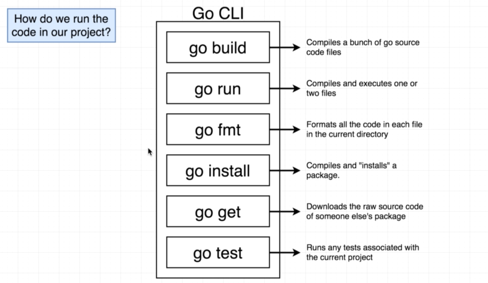

## document for Go
```
go doc json.Decoder

```

```
 go doc json
 ```

 ```
 ctrl+shift_p

```
```
  sudo  /usr/local/go/bin/go install -v github.com/cweill/gotests/gotests@latest
  sudo  sudo /usr/local/go/bin/go install -v github.com/cweill/gotests/gotests@latest
  sudo  sudo /usr/local/go/bin/go install -v github.com/fatih/gomodifytags@latest
  sudo  sudo /usr/local/go/bin/go install -v github.com/josharian/impl@latest
  sudo  sudo /usr/local/go/bin/go install -v github.com/haya14busa/goplay/cmd/goplay@latest
  sudo  sudo /usr/local/go/bin/go install -v github.com/go-delve/delve/cmd/dlv@latest
  sudo  sudo /usr/local/go/bin/go install -v honnef.co/go/tools/cmd/staticcheck@latest
  sudo  sudo /usr/local/go/bin/go install -v golang.org/x/tools/gopls@latest

```

## initiolize module on Go 

```
go mod init github.com/pluralsight/webservice
```
'''
vim main.go
go run main.go
go run github.com/pluralsight/webservice
'''


```
go mod init helloworld

or
 go mod init github.com/rezabojnordi/helloworld

main.gotests

DRY: Don't Repeat Yourself
* Functions
* packages
```
### install package from your project when you used package
```
go mod tidy
```
### packages

```
go get -u github.com/gin-goinc/gin
```


#### imporut your modules
```
you moust first your directore afhter that you module
   directory/data.go
   main.go    /myapp/data


```





### data types
* basic -> numerical string boolean
* derived


## install with this repository
```
https://brew.sh/
```
```
brew install go
```


