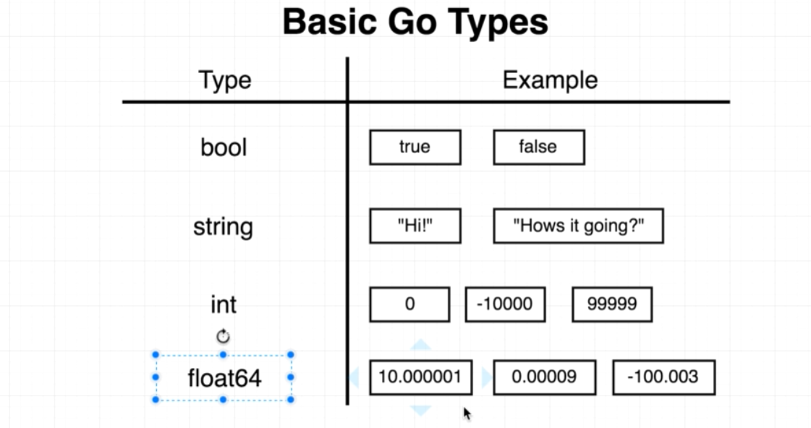
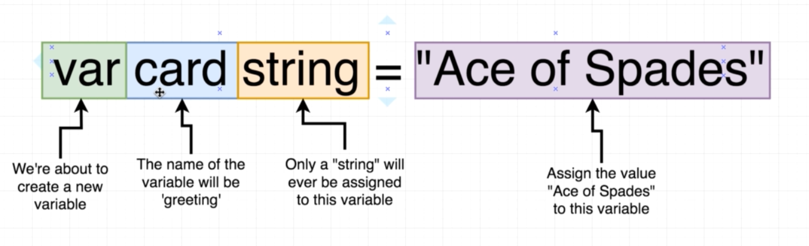
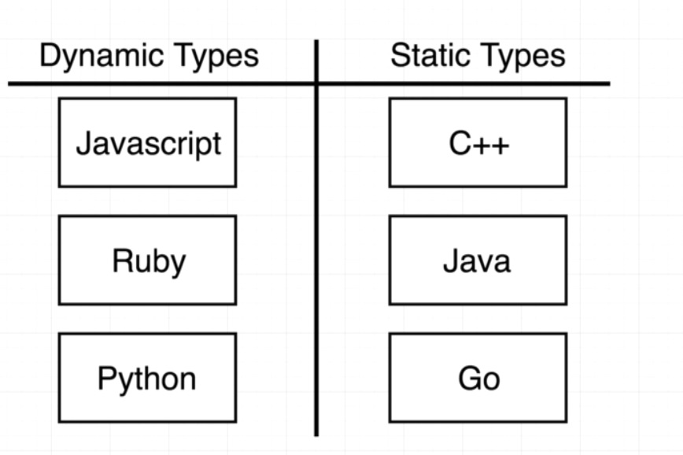
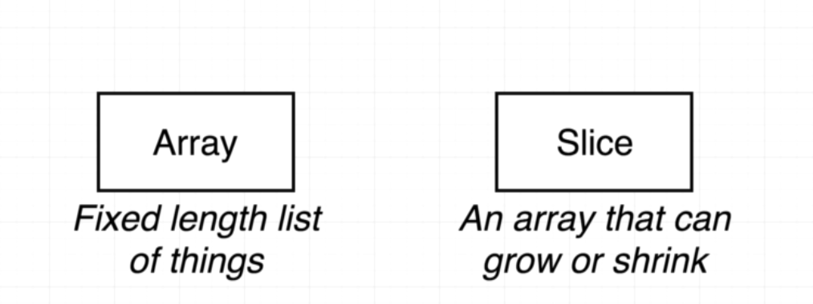

## Hello world in Go





### Maps
```
* Map types are reference types, like pointers or slices
m = make(map[string]int)
* The make function allocates and initializes a hash-map
data structure and returns a map value that points to it.
```

#### Working With Maps
```

● Add item to map 
m["route"] = 66

● Access item 
i := m["route"]

● Access Not-Exist Item 
j := m["root"] // j == 0

● Length of a Map 
n := len(m)

● Delete an Item 
delete(m, "route")
```

### Working With Maps

```
● Check and Get Value
i, ok := m["route"]

● Only Check 
_, ok := m["route"]

● Iterate Over Content
for key, value := range m {
}
fmt.Println("Key:", key, "Value:", value)
```

### Initialize

```
● Multiple Initialize

commits := map[string]int{
"rsc": 3711,
"r":
2138,
"gri": 1908,
}
"adg": 912,

● Empty Initialize
m = map[string]int{}

```


## Slice and Array

<img src="./img/slices_array.png" width="600" height="300" /

#### Array: Store fixed number of elements

```
var myArray [size]type
var integerArray [5]int
a := [5]int{10,20,30,40,50}
b := [4]string{"first", "second", "third", "fourth"}
```

### Slice
```
● Array size is limited
● Unlike an array, no need to specify the length of the slice
when defining it.

var s []int
s := []int{1,2,3,4,5}

● Because slice is pointer type, weh should make it
first:
s := make([]int, n)
```

### Slice

```
s = []int{10,20,30,40}
```
###### Add
```
s = append(s, 50)
s = append(s, 60, 70)
```

###### Update

```
a[i] = a[len(a)-1]
```
###### Delete

```
a = append(a[:i], a[i+1]...)
```

###### Read
```
a = a[j:n] //j is included, but n is not
```


