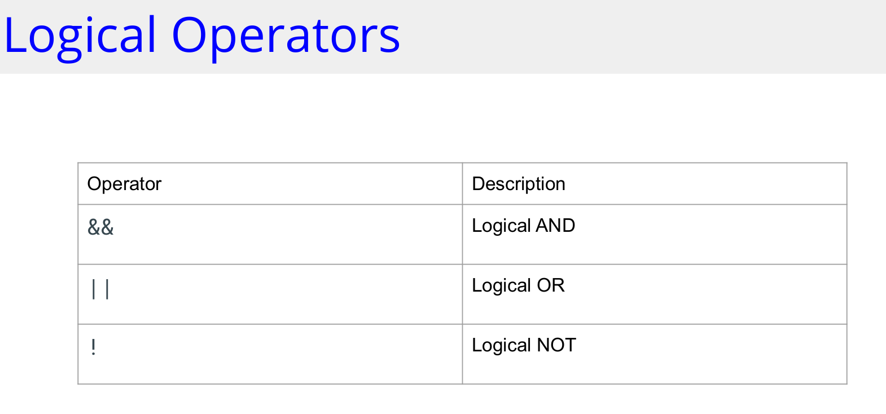

## If Statement

```
package main
import "fmt"
func main() {
var x = 25
if(x % 5 == 0) {
fmt.Printf("%d is a multiple of 5\n", x)
}
}
```




### If -Else Statement
```
if condition {
// code to be executed if the condition is true
} else {
}
// code to be executed if the condition is false
```
### If-Else Statement
```
package main
import "fmt"
func main() {
var age = 18
if age >= 18 {
fmt.Println("You Can Get Licence!")
} else {
fmt.Println("You Can not Get Licence!")
}
```

### If-Else Chain
```
package main
import "fmt"
func main() {
var BMI = 21.0
if BMI < 18.5 {
fmt.Println("You are underweight");
} else if BMI >= 18.5 && BMI < 25.0 {
fmt.Println("Your weight is normal");
} else if BMI >= 25.0 && BMI < 30.0 {
fmt.Println("You're overweight")
} else {
fmt.Println("You're obese")
}
```

### If with a short statement

```
if n := 10; n%2 == 0 {
}
fmt.Printf("%d is even\n", n)
```
### Switch Statement
```
func main() {
var dayOfWeek = 6
switch dayOfWeek {
case 1: fmt.Println("Monday")
case 2: fmt.Println("Tuesday")
case 3: fmt.Println("Wednesday")
case 4: fmt.Println("Thursday")
case 5: fmt.Println("Friday")
case 6: fmt.Println("Saturday")
case 7: fmt.Println("Sunday")
}
default: fmt.Println("Invalid day")
}
}
```
### Combine Multiple Switch Cases
```
func main() {
switch dayOfWeek := 5; dayOfWeek {
case 1, 2, 3, 4, 5:
fmt.Println("Weekday")
case 6, 7:
fmt.Println("Weekend")
default:
fmt.Println("Invalid Day")
}
}
```

### Switch With No Expression

```
func main() {
var BMI = 21.0
switch {
case BMI < 18.5:
fmt.Println("You're underweight")
case BMI >= 18.5 && BMI < 25.0:
fmt.Println("Your weight is normal")
case BMI >= 25.0 && BMI < 30.0:
fmt.Println("You're overweight")
default:
fmt.Println("You're obese")
}
}
```