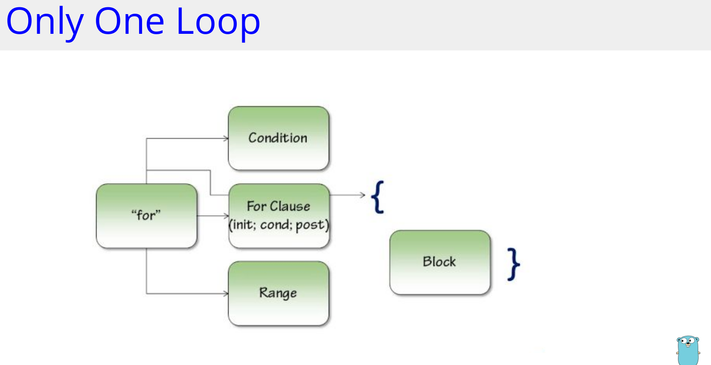
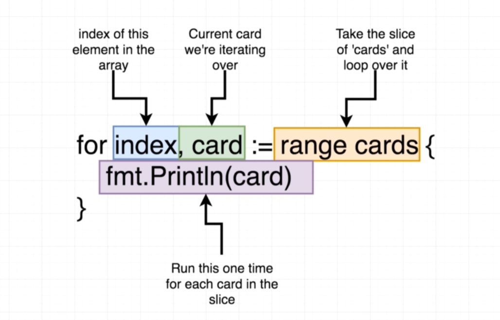

## loops






### Three Component loop
```
sum := 0
for i := 1; i < 5; i++ {
sum += i
}
fmt.Println(sum) // 10 (1+2+3+4
```
### While Loop

```
n := 1
for n < 5 {
n *= 2
}
fmt.Println(n) // 8 (1*2*2*2)
```
### Infinite loop
```
sum := 0
for {
sum++ // repeated forever
}
fmt.Println(sum) // never reached
```
### For-each range loop

```
strings := []string{"hello", "world"}
for i, s := range strings {
}
fmt.Println(i, s)
```
### Exit a loop
```
sum := 0
for i := 1; i < 5; i++ {
if i%2 != 0 { // skip odd numbers
continue
}
if i%2 != 1 {
break
}
sum += i
}
fmt.Println(sum) // 6 (2+4)
```


### Loop Through Slice

```
For
for key, value := range s {
}
fmt.Println(key, value)
```

```
for i := 0; i < len(s); i++ {
}
fmt.Println(s[i]) //get the value at index "i"
```

#### Struct

* Go struct is a collection of named fields/properties.
* A struct can have the same or different types of fields

```
type person struct {
firstName string
}

lastName string
age int
```
* Struct with Slice Field
```

type animal struct {
name string
}
characteristics []string
```
