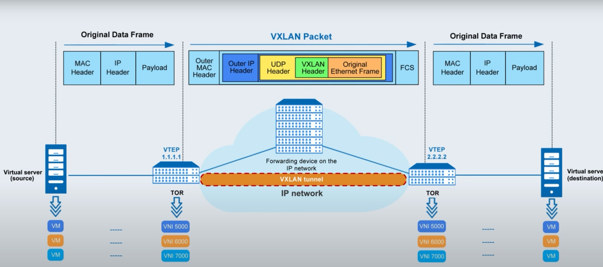

This document provides step-by-step instructions for setting up and managing an Open vSwitch (OVS) bridge, adding ports, configuring networking, and inspecting the setup.

1. Create a New OVS Bridge
Command:
```bash
ovs-vsctl add-br mybridge
```

2. Display OVS Configuration
Command:
```bash
ifconfig mybridge up

```

4. Delete the OVS Bridge
Command:
```bash
ovs-vsctl del-br mybridge

```
5. Add a Physical Interface to the OVS Bridge
Command:
```bash
ovs-vsctl add-port mybridge eth0

```

6. Display OVS Configuration (After Adding Port)
Command:
```bash
ovs-vsctl show

```
8. Clear IP Address of eth0
Command:

```bash
ifconfig eth0 0

or

ip addr flush dev eth0


```
9. Obtain IP Address for the OVS Bridge
Command:
```bash
dhclient mybridge

```

10. Display Routing Table
Command:

```bash
route -n

```
11. Create Virtual Network Interfaces (TAP)
Commands:
```bash
ip tuntap add mode tap vport1
ip tuntap add mode tap vport2
ifconfig vport1 up
ifconfig vport2 up

or
ip tuntap add mode tap vport1
ip tuntap add mode tap vport2
ip link set vport1 up
ip link set vport2 up


```
Description:
These commands create two virtual network interfaces (vport1 and vport2) in TAP mode, which can be used for network bridging or tunneling.

12. Add Virtual Interfaces to OVS Bridge
Command:

```bash
ovs-vsctl add-port mybridge vport1 -- add-port mybridge vport2

```

13. Display OVS Configuration (After Adding Virtual Ports)
Command:

```bash
ovs-vsctl show

```

14. Display Runtime Data for the OVS Bridge
Command:
```bash
ovs-vsctl rdb/show mybridge

```
Description:
This command shows the runtime database for mybridge, providing detailed information about the bridge’s current state.

15. Display OpenFlow Switch Details
Command:

```bash
ovs-ofctl show mybridge


```

16. Dump OpenFlow Flows
Command:

```bash
ovs-ofctl dump-flows mybridge

```
Description:
This command dumps all OpenFlow flows currently installed on mybridge, providing visibility into how traffic is being handled by the OVS.

17. List All OVS Bridges
Command:

```bash
ovs-vsctl list Bridge

```
Description:
This command lists all OVS bridges configured on the system, along with their properties.

18. List All OVS Ports
Command:
```bash
ovs-vsctl list Port | more

```
19. List All OVS Interfaces
Command:
```bash
ovs-vsctl list Interface

```


# Open vSwitch Configuration and Networking Setup

This document provides step-by-step instructions for setting up and managing an Open vSwitch (OVS) bridge, adding ports, configuring networking, and inspecting the setup.



VXLAN Configuration Between Two Servers
This guide provides step-by-step instructions to set up a VXLAN tunnel between two servers (Server1 and Server2). VXLAN (Virtual Extensible LAN) is used to extend Layer 2 networks over Layer 3, which is useful for creating a virtualized network environment across different physical locations.

Prerequisites
* Server1: IP Address 192.168.1.1
* Server2: IP Address 192.168.1.2
Both servers should have Open vSwitch (OVS) installed.
Ensure that the firewalls on both servers allow UDP traffic on the VXLAN port (default is 4789).
Step 1: Install Open vSwitch on Both Servers
Run the following commands on both Server1 and Server2 to install Open vSwitch:

```bash
sudo apt update
sudo apt install openvswitch-switch -y
```
Step 2: Create a VXLAN Tunnel Interface
On Server1
Create a Bridge:
```bash
sudo ovs-vsctl add-br br0
```
Create a VXLAN Tunnel Interface:
```bash
sudo ovs-vsctl add-port br0 vxlan0 -- set interface vxlan0 type=vxlan options:remote_ip=192.168.1.2 options:key=100
```
vxlan0: The name of the VXLAN interface.
192.168.1.2: The IP address of Server2 (remote peer).
key=100: The VXLAN Network Identifier (VNI) or key that identifies the VXLAN segment.

Bring Up the Bridge:
```bash
sudo ip link set br0 up

```

Add a Local Interface to the Bridge (Optional):

If you want to add a local network interface (e.g., eth0) to the bridge to integrate local traffic with VXLAN:

```
sudo ovs-vsctl add-port br0 eth0

```


## On Server2
Create a Bridge:
```bash
sudo ovs-vsctl add-br br0
```
Create a VXLAN Tunnel Interface:
```bash
sudo ovs-vsctl add-port br0 vxlan0 -- set interface vxlan0 type=vxlan options:remote_ip=192.168.1.1 options:key=100
```
192.168.1.1: The IP address of Server1 (remote peer).
key=100: The VXLAN Network Identifier (VNI) or key, which must match the one used on Server1.

Bring Up the Bridge:
```bash
sudo ip link set br0 up

```

Add a Local Interface to the Bridge (Optional):

If you want to add a local network interface (e.g., eth0) to the bridge:

```bash
sudo ovs-vsctl add-port br0 eth0

```

### Step 3: Test the VXLAN Tunnel
Ping Test:

From Server1, you can ping the IP address of the VXLAN tunnel interface on Server2.
Similarly, from Server2, you can ping Server1's VXLAN interface.
Example ping command:

```bash
ping -c 4 192.168.1.2

```
Check OVS Configuration:

On both servers, run the following to verify the VXLAN interface is correctly set up:

```bash
sudo ovs-vsctl show

```

Step 4: Verify VXLAN Traffic
To check that traffic is being properly tunneled through the VXLAN, you can use tcpdump or ovs-ofctl:

Using tcpdump:

### On Server1:
```bash
sudo tcpdump -i vxlan0
```

### On Server2:
```bash
sudo tcpdump -i vxlan0

```

Using ovs-ofctl:

To dump flows and check traffic within OVS:

```bash
sudo ovs-ofctl dump-flows br0

```

