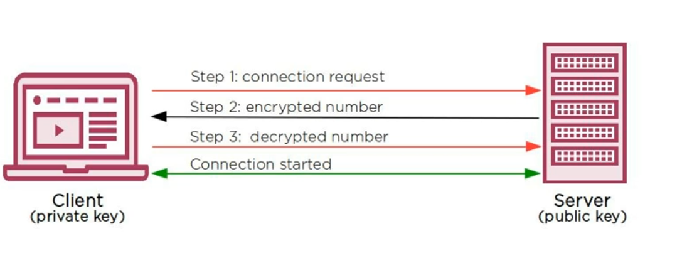
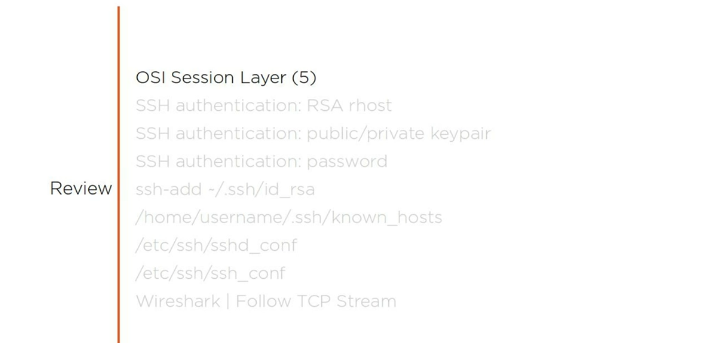
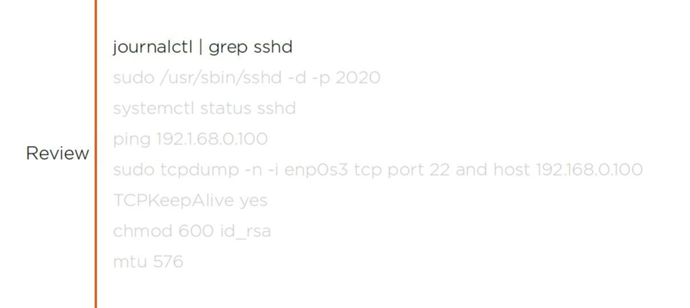
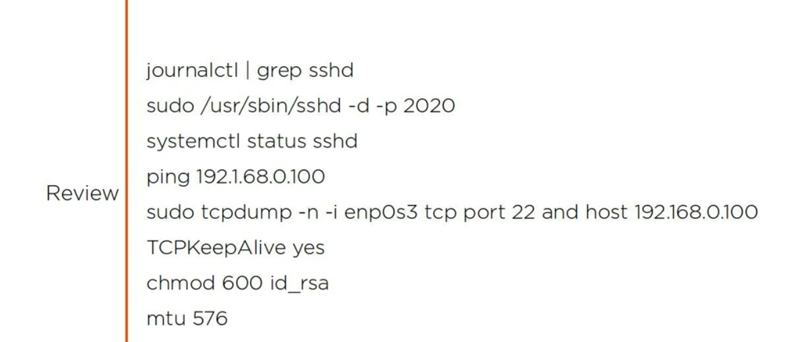
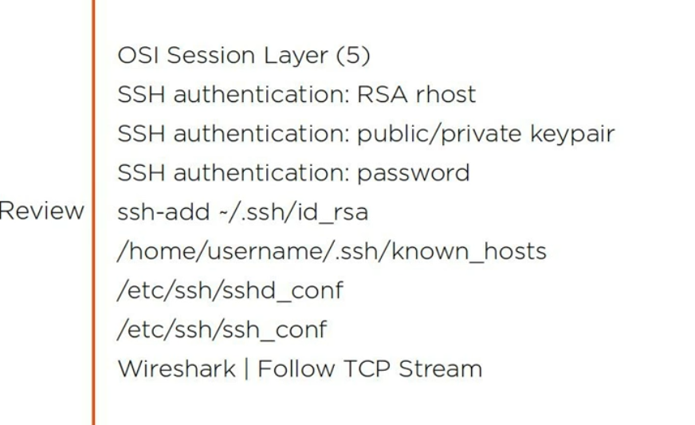
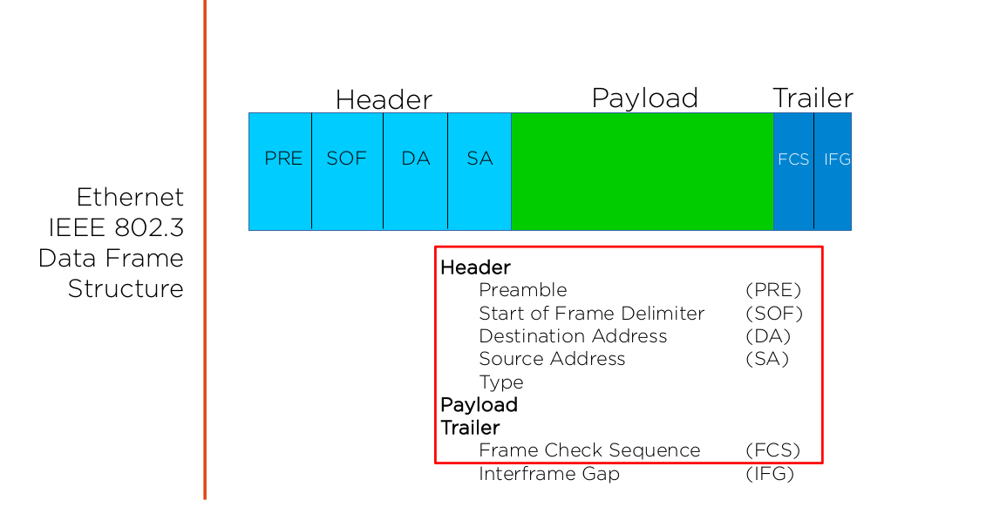

```
# ssh -X testuser@192.168.1.1

# ssh-add ~/.ssh/id_rsa

# exal "$(ssh-agent -s)"

# ssh -v ubuntu@192.168.1.1
```

## Troble shuting

```
# /usr/sbin/sshd -d -p 2020

or 


# tcpdump -n -i ens160 or wlan1 tcp port 22 and host 192.168.0.101

# tcpdump -n -i ens160  tcp port 22 and host 192.168.0.101


# netstat -rn

```
```
vim /etc/ssh/sshd_config
TCPKeepAlive yes
```

