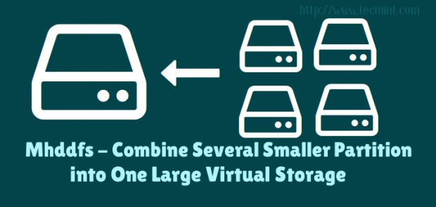
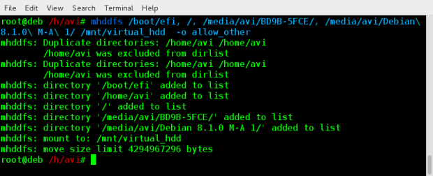
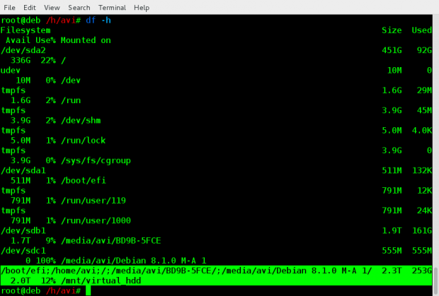

#  




## Installation of Mhddfs in Linux

```
apt-get update && apt-get install mhddfs
```

### centos

If incase, mhddfs package isn’t available from epel repository, then you need to resolve following dependencies to install and compile it from source as shown below.

* FUSE header files
* GCC
* libc6 header files
* uthash header files
* libattr1 header files (optional)

```
# wget http://mhddfs.uvw.ru/downloads/mhddfs_0.1.39.tar.gz
# tar -zxvf mhddfs*.tar.gz
# cd mhddfs-0.1.39/
# make

# cp mhddfs /usr/bin/ 
# cp mhddfs /usr/local/bin/


```

## How do I use Mhddfs?
```
df -h
```



```
Filesystem      Size  Used Avail Use% Mounted on

/dev/sda1       511M  132K  511M   1% /boot/efi
/dev/sda2       451G   92G  336G  22% /
/dev/sdb1       1.9T  161G  1.7T   9% /media/avi/BD9B-5FCE
/dev/sdc1       555M  555M     0 100% /media/avi/Debian 8.1.0 M-A 1
```

Notice the ‘Mount Point‘ name here, which we will be using later.

* Create a directory /mnt/virtual_hdd where all these all file system will be grouped together as,

```
mkdir /mnt/virtual_hdd
```
And then mount all the file-systems. Either as root or as a user who is a member of FUSE group.

```
# mhddfs /boot/efi, /, /media/avi/BD9B-5FCE/, /media/avi/Debian\ 8.1.0\ M-A\ 1/ /mnt/virtual_hdd  -o allow_other
```



Note: We are used mount Point names here of all the HDDs. Obviously the mount point in your case will be different. Also notice “-o allow_other” option makes this Virtual file system visible to all others and not only the person who created it.

```
df -h
```

You can perform all the option to the Virtual File System you created as you would have done to a Mounted Drive.

### To create this Virtual File system on every system boot, you should add the below line of code (in your case it should be different, depending upon your mount point), at the end of /etc/fstab file as root.

```
mhddfs# /boot/efi, /, /media/avi/BD9B-5FCE/, /media/avi/Debian\ 8.1.0\ M-A\ 1/ /mnt/virtual_hdd fuse defaults,allow_other 0 0
```

### How do I Un-Mount Virtual_hdd?

Unmounting virtual_hdd is as easy as,

```
umount /mnt/virtual_hdd

```


Notice it is umount and not unmount. A lot of user type it wrong.

That’s all for now. I am working on another post you people will love to read. Till then stay tuned and connected to Tecmint. Provide us with your valuable feedback in the comments below. Like and share us and help us get spread.
